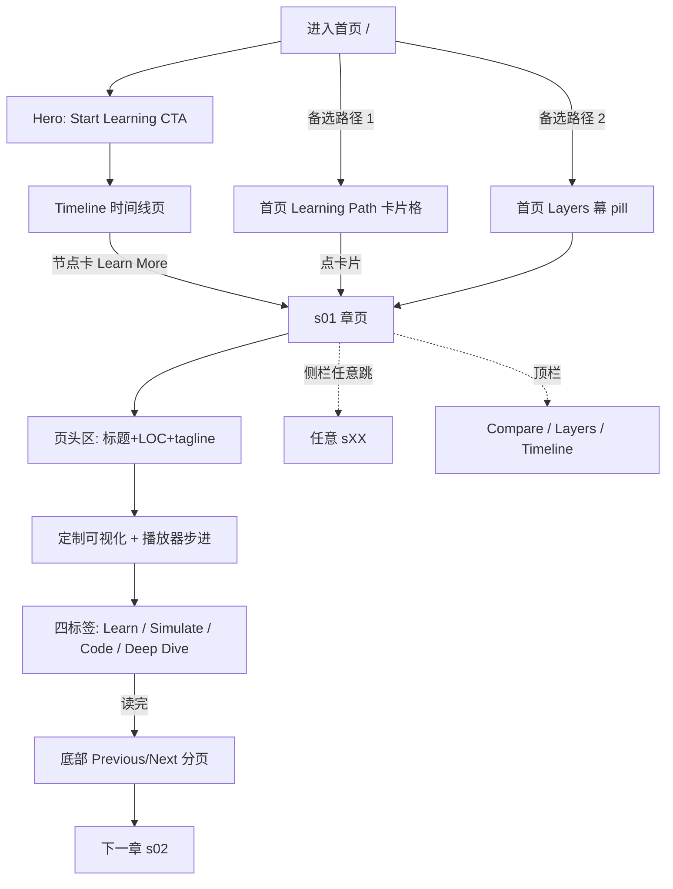

# learn.shareai.run 活体走查报告 —— 内容组织 + 交互方式

> 走查人: lcx-live agent | 日期: 2026-09-12
> 方法: web-access CDP 模式直连 Chrome，真实新读者路径亲历（首页→章节→跨章→辅助页→语言切换），全部观察基于活体 DOM + 截图，证据带 URL。
> 范围声明: 关注「内容怎么组织、读者怎么被引导、交互怎么服务理解」；动画视觉细节不展开（另有专门研究）。后台 tab 渲染时序局限在评注中如实标注。

---

## 一、站级信息架构

### 1.1 站点定位

- **标题**: Learn Claude Code（GitHub: shareAI-lab/learn-claude-code）
- **副标题**: "Build a nano Claude Code-like agent from 0 to 1, one mechanism at a time"
- **内容本体**: 20 个渐进章节（s01–s20），每章 = 一个可运行 Python 版本（102 LOC → 1708 LOC），从最小 agent loop 长成完整 multi-agent harness

### 1.2 页面清单与路由

| 路由 | 页面 | 角色 |
|---|---|---|
| `/en/` `/zh/` `/ja/` | 首页 | 营销幕+三入口引导 |
| `/en/timeline/` | Learning Path（Timeline） | 线性学习路径（"Start Learning" CTA 落地页） |
| `/en/compare/` | Compare Versions | 任意两版本 diff 工具 |
| `/en/layers/` | Architectural Layers | 五层架构视图 |
| `/en/s01/` … `/en/s20/` | 20 个章节页 | 学习本体 |

- 语言切换 = 顶栏 EN/中文/日本語 三按钮，点击即 URL 前缀切换（`/en/layers/` → `/zh/layers/`），侧栏、正文、甚至代码内 diff 注释全量翻译。默认入口按浏览器语言重定向（直接访问根域名落到 `/en/`）。

### 1.3 首页五幕结构（`/en/`，自上而下）

1. **Hero 幕**: 大标题 + 副标题 + 唯一 CTA "Start Learning →"（指向 `/en/timeline/`，不是 s01）
2. **The Core Pattern 幕**: 假终端窗口（`agent_loop.py`）静态展示核心 while-loop 伪代码，红黄绿三点窗饰。定位：30 秒讲清全站主题
3. **Message Growth 幕**: 活体动画——`messages[]` 数组可视化，消息 chip（user/assistant/tool_call/tool_result 彩色块）随 agent loop 执行逐个追加，`len=6` 计数器实时增长。已用强制帧连拍证实动画真实推进
4. **Learning Path 幕**: 20 张章节卡（3 列网格）= s 徽章（层色）+ LOC 数 + 标题 + 一句话描述；hover 有边框高亮
5. **Architectural Layers 幕**: 5 条层分组行（"N versions" 计数 + 彩色 pill 链接直接进章），层色与全站一致：蓝=Tools & Execution(4)、绿=Planning & Control(5)、紫=Memory Management(2)、琥珀=Concurrency & Scheduling(2)、红=Multi-Agent Platform(7)

无页脚。首页是纯静态引导层（无 canvas/iframe，仅 3 个 svg），动效集中在 Message Growth。

### 1.4 顶层导航语义（顶栏，全站持久）

`Learn Claude Code`（回首页）· `Timeline` · `Compare` · `Layers` · 语言三键 · 主题切换 · GitHub

信息语义：**同一套 20 章内容的三根正交组织轴**——Timeline=时间/难度序（我怎么按顺序学），Compare=版本间对比（任意两章 diff），Layers=架构分组（按关注点横向看）。加上首页的 Learning Path 网格与 Layers 幕，共 5 个进入章节的路径。

### 1.5 章节侧栏（章页持久，桌面包裹主内容）

20 章按五层分组排列（组头 = 彩色圆点 + 大写层名），**组内编号刻意不连续**（如 Planning & Coordination 组含 s05/s06/s07/s10/s11）——编号=构建顺序，分组=架构归属，两套坐标系并存。当前章灰底高亮。注意：侧栏仅在章页/Timeline/Compare/Layers 出现，首页无侧栏。

### 1.6 新读者路径图



字符画版本:
```
        ┌─────────── 首页 / ───────────┐
        │ Hero(CTA)  卡片格  Layers幕  │
        └────┬──────────┬───────┬─────┘
             │(主路径)   │(备选1) │(备选2)
             ▼          ▼        ▼
          Timeline    点卡片    点pill
             │          │        │
             └────┬─────┴────────┘
                  ▼
            ┌─ 章页 sXX ─────────────────┐
            │ 页头 → 可视化+播放器        │
            │ → [Learn|Simulate|Code|DD] │
            │ → Previous/Next 分页        │
            └──────┬──────┬──────────────┘
                   │      └─侧栏任意跳章─→ 任意 sXX
                   ▼
               下一章(线性主循环)
```

主路径是「首页 CTA → Timeline 线性浏览 → s01 → Next 串联」，侧栏与三辅助页构成旁路。

---

## 二、章页内容组织（以 s01 为主样本，s02/s05 交叉验证）

### 2.1 章页纵向结构（自上而下四段式）

1. **页头**: `s01` 徽章 + H1 标题 + 层色 pill（如 "Tools & Execution"）+ 营销副标题（"One Loop Is All You Need"）+ 元数据行（`102 LOC · 1 tools · [Minimal model/tool loop]`）+ 斜体 tagline 引言（左侧竖线引用样式）
2. **持久可视化区块**（四标签共享，切标签不消失）: 每章**定制**的交互可视化（s01=flowchart+messages[] 双面板 "The Agent While-Loop"；s05=TodoWrite 看板 "Nag System"）+ 蓝框说明卡（步骤解说，随步进换文案）+ 播放器控制条（Reset/Previous/Auto-play/Next 四键 + 步点 + `1/7` 步数）
3. **四标签栏**: `Learn | Simulate | Code | Deep Dive`（active 态 = 底部 2px 边框），切换只替换标签栏以下内容
4. **标签内容区**（详见 2.2）+ 页尾 **Previous/Next 章分页**（s01 只有 Next；文案如 "Next / Tool Use - s02 →"）

章页是「**分区驻留 + 标签内长滚动**」混合体：可视化与页头常驻，标签内容各自成篇。

### 2.2 四标签的内容形态

| 标签 | 内容形态 | 体量（s01 实测） | 教学角色 |
|---|---|---|---|
| **Learn** | 长文滚动文章，H2 分区：The Problem → The Solution（蓝头 SVG 大图+信号对照表）→ How It Works → Try It（TERMINAL 代码块×2 + 编号 prompt chips ×3 + "What to watch for"）→ What's Next（前向钩子） | 页高 5111px，主体 | 概念叙事+上手指引 |
| **Simulate** | "Agent Loop Simulator"：Play/Step/Reset + 速度选择（0.5x/1x/2x/4x）+ `N of M` 计数；逐步出**消息卡**（角色图标+内容+斜体教学注解，如 "The model decides to use its only tool: bash"） | s01=8 步, s05=6 步 | 看运行时行为 |
| **Code** | 假终端文件名条（三点 + `s01_agent_loop/code.py`）+ 全量源码 + 行号 + 语法高亮 | 138 行全量 | 看真实实现 |
| **Deep Dive** | Execution Flow 彩色流程图（mermaid 风）+ Architecture 框（类/工具清单，无类时显示 "No classes in this version (functions only)"）+ Design Decisions **折叠面板**（chevron 手风琴，如 "Why Bash Alone Is Enough"） | s01=3 个折叠项 | 设计权衡 |

### 2.3 增量叙事（版本演化是全站的组织灵魂）

- s02 Learn 含 **"Changes from s01"** Before/After 对照表（Component | Before (s01) | After (s02)）
- 首页卡片、Timeline 卡片都把 **LOC 数**作为一等公民展示（Timeline 还有 LOC 相对进度条，层色渲染）
- Compare 页把增量做到极致（见交互清单）

### 2.4 多语言深度

代码注释、Compare 的 diff 行内容（如 "+ s02: Tool Use — 在 s01 基础上新增 4 个工具 + 分发映射。"）都是中文——**代码即内容、内容即翻译**，不是外壳翻译。

---

## 三、交互物件盘点

### 播放器/模拟类

| 物件 | 所在页 | 触发 | 读者反馈 |
|---|---|---|---|
| Learn 步进播放器 | 每章可视化区块（如 s01 `1/7`、s05 `1/7`） | 点 Reset/Previous/Auto-play/Next | 可视化状态推进（流程图高亮/看板卡片出现）+ 蓝框说明卡换文案 + 步点与步数更新 |
| Agent Loop Simulator | 每章 Simulate 标签（s01 "0 of 8"、s05 "0 of 6"） | Play（自动）/Step（单步）/Reset；速度 0.5x–4x | 面板逐张追加消息卡（角色+内容+斜体注解），计数器实时 `N of M` |
| Message Growth 动画 | 首页第 3 幕 | 进入视口自动播放 | 消息 chip 逐个追加 + `len=N` 计数增长（强制帧连拍证实推进） |
| Design Decisions 手风琴 | 每章 Deep Dive | 点击折叠条 | 展开设计权衡正文（带展开动画），其余项不动 |

### 代码展示类

| 物件 | 所在页 | 触发 | 读者反馈 |
|---|---|---|---|
| 假终端代码块 | Learn 的 Try It（TERMINAL 徽章）、Code 全量源码、首页 Core Pattern | 静态展示/滚动 | 文件名条 + 行号 + 语法高亮；**无复制按钮、无 GitHub 文件直链** |
| Before/After 表 | s02+ Learn "Changes from sXX" | 静态 | 组件级前后对照 |
| Source Code Diff | Compare 页选两版本后 | 选 Version A/B 下拉 | 双行号 unified diff（红/绿行）+ **Unified/Split 切换**；上方四联 delta 卡（LOC Delta +33 绿字 / New Tools 4 / New Classes 0 / New Functions 5 带函数名 chips）+ 工具三栏对比（Only in A / Shared / Only in B） |

### 导航类

| 物件 | 所在页 | 触发 | 读者反馈 |
|---|---|---|---|
| 顶栏三辅助页链接 + 语言键 + 主题键 | 全站 | 点击 | URL 前缀切换（语言）/整页跳转；当前页顶栏无高亮态（Timeline 页实测顶栏 "Timeline" 有加粗高亮） |
| 五层分组章节侧栏 | 章页/Timeline/Compare/Layers | 点击章名 | 整页跳转 + 滚动复位顶部；当前章灰底高亮 |
| Previous/Next 章分页 | 每章页尾 | 点击 | 线性主循环跨章 |
| Timeline 垂直时间线 | `/en/timeline/` | 滚动 + 点节点卡 "Learn More →" | 20 节点垂直排列（层色圆点编号），每卡=s 徽章+副标题+标题+LOC/tools+LOC 进度条+引言+链接 |
| Layers 分组卡片网格 | `/en/layers/` | 滚动 + 点卡片 | 每层一块（层定义一句话 + 卡片网格，卡带域 chip: tools/planning） |
| 首页章节卡/Layers pill | 首页 | 点击 | 直接进章 |

### 进度/元数据反馈类

| 物件 | 所在页 | 反馈 |
|---|---|---|
| LOC + tools 计数 | 首页卡/Timeline 卡/章页头/Layers 卡 | 代码量作为"这一章有多重"的量化信号，贯穿全站 |
| LOC 进度条 | Timeline 卡片 | 相对最长章（s20=1708 LOC）的长度比例，层色渲染 |
| 步点 + `N/M` 计数 | Learn 播放器 / Simulate | 播放位置感 |
| Nag Timer `0/3`、Progress `0/4 complete` | s05 可视化内部 | 定制可视化自带内嵌状态计数，与播放器步进联动 |
| "Press Play or Step to begin" | Simulate 空态 | 明确的行动引导 |

**未发现**: 站内搜索、quiz/challenge 自测类物件、阅读进度指示、键盘快捷键提示。Simulate 是"看预设剧本回放"，不是可输入的沙盒（无 input/select，读者不能输入自己的 prompt）。

---

## 四、亲历体验评注（凭走查实录）

### 顺滑点

1. **Simulate 单步节奏极佳**（s01 Simulate）：点 Step 立即出一张消息卡，计数器 `3 of 8` 同步、卡片注解（斜体教学旁白）与内容一体出现——"每一步发生什么+为什么"零割裂，是全站最服务理解的交互。
2. **语言切换零成本**（Layers 页实测）：顶栏点「中文」，URL 前缀原位切换，侧栏/正文/卡片全量翻译，无刷新闪烁感、无丢位置。
3. **Compare 即选即得**（Compare 页）：两个下拉选 s01/s02，无需提交按钮，四联 delta 卡 + 工具三栏 + 带行号 diff 一次性呈现，"+33 lines" 绿色数字一眼看到增量本质。
4. **四标签共享可视化区块**（s01/s05 交叉验证）：切 Simulate/Code/Deep Dive 时顶部可视化与播放器不动——读者在 Code 标签看源码时随时抬头可回看流程图，上下文不丢。
5. **跨章侧栏跳转后滚动复位**（s01→s02 实测）：换章必回页顶，不会停在上一章的滚动深度，位置感清晰。

### 卡点

1. **Code 标签是"死代码"**（s01 Code）：无复制按钮、无 GitHub 对应文件直链——读者想拿走这份 `s01_agent_loop/code.py` 只能手动圈选 138 行或自己去仓库翻，与"Try It 让你真跑"的教学闭环脱节。
2. **Learn 长文无页内导航**（s01 Learn，页高 5111px）：五个 H2 分区没有 TOC/锚点/返回标签栏的浮动入口，读到 "Try It" 想回看 "The Solution" 只能靠长滚。
3. **四标签位置低于首屏折叠线**（s01 首屏，标签栏 y≈950/993 视口）：新读者首屏只看到播放器，容易不知道下方还有 Simulate/Code/Deep Dive 三个重量级分区——本走查第一次也是滚动后才看见。
4. **Timeline 卡片在后台 tab 有明显渲染延迟**（Timeline 页，走查环境限制）：前两次强制帧截图中节点旁卡片整片空白，第三次才完整渲染。DOM 中卡片始终存在（opacity=1、尺寸正常 896×205px），判断为后台 tab 绘制管线时序问题而非站点缺陷，**前台表现未能活体证实，存疑待前台复验**。
5. **首页与 Timeline 内容重复度高**：首页 Learning Path 卡片格与 Timeline 页卡片信息几乎同构（徽章+标题+一句话），新读者在两个入口间选择成本 > 增益；首页 Layers 幕又是第三份同构列表。
6. **s05 播放器双计数器初见困惑**（走查中真实发生）：页内同时存在 Nag Timer `0/3` 与播放器 `1/7`，走查者一度把 `1/3`（Nag Timer 步进后）误读为播放器步数。定制的内嵌计数器多了之后，"哪个数字是进度"需要读者现场分辨。

---

## 五、内容地图（缩进树）

```
learn.shareai.run (Learn Claude Code, 三语言 en/zh/ja)
├── 首页 /
│   ├── Hero（CTA → Timeline）
│   ├── The Core Pattern（静态假终端: agent_loop.py）
│   ├── Message Growth（动画: messages[] 增长）
│   ├── Learning Path（20 章卡片格: 徽章+LOC+标题+一句话）
│   └── Architectural Layers（5 层 pill 行 → 直链各章）
├── Timeline /timeline/（垂直时间线: 20 节点卡 = 徽章+副标题+LOC条+引言+Learn More）
├── Compare /compare/（双下拉选版本 → 摘要双卡+Architecture 对照+四联delta+工具三栏+Unified/Split diff）
├── Layers /layers/（5 层块: 层定义+卡片网格（域chip+LOC+tools））
└── 章节页 /s01…s20/（页头: 徽章+层pill+副标题+LOC/tools+tagline）
    ├── 持久定制可视化（每章不同: s01 流程图+messages[]、s05 Todo 看板）+ 说明卡 + 播放器(1/7)
    ├── Learn（长文: Problem→Solution→How It Works→Try It→What's Next; s02+ 含 Changes 表）
    ├── Simulate（Agent Loop Simulator: Play/Step/Reset+速度+N of M 逐步出卡）
    ├── Code（假终端文件名条+全量源码+行号）
    ├── Deep Dive（Execution Flow 图+Architecture 框+Design Decisions 手风琴）
    └── Previous/Next 章分页
侧栏（章页起出现）: 20 章按 5 层分组（编号≠分组, 双坐标系）+ 当前章高亮
顶栏（全站）: Logo | Timeline | Compare | Layers | EN/中文/日本語 | 主题 | GitHub
```
