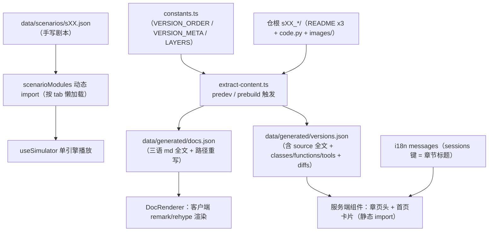

# learn.shareai.run 源码级调研：内容组织的工程化（lcx-src）

> 调研日期 2026-09-12。方法：zread MCP 拉取 GitHub `shareAI-lab/learn-claude-code` master 快照的目录树与关键文件全文，行号按该快照回数（未标行号的以函数/区块名为锚）。只读调研，本文件为唯一写入产物。

## 1. 仓库 URL 与结构速览

**仓库**: https://github.com/shareAI-lab/learn-claude-code（master 分支）

三层结构，职责分明：

```
仓根（内容真源）
├── s01_agent_loop/ … s17_goal_loop/     # 17 个章节目录 = 内容单一事实来源
│   ├── README.md / README.zh.md / README.ja.md   # 三语文正文
│   ├── code.py                          # 该章可运行的 Python 实现
│   └── images/*.svg                     # 章节插图（含 .en./.ja. 语言变体）
├── agents/ + docs/                      # legacy 旧版（extract 有 fallback 双轨逻辑）
├── tests/                               # 含 test_chapter_readmes.py（章节文档有 CI 断言）
└── web/                                 # Next.js 16 站点（learn.shareai.run 本体，Vercel 部署）
    ├── package.json                     # predev/prebuild 先跑 extract
    ├── scripts/extract-content.ts       # 内容管线：仓根 → 生成 JSON
    └── src/
        ├── lib/constants.ts             # 章节清单/元数据/学习路径（手写单一来源）
        ├── data/
        │   ├── generated/{versions,docs}.json   # extract 产物（git 内提交）
        │   ├── scenarios/s01..s17.json  # 手写模拟器剧本（声明式步进表）
        │   ├── annotations/s01..s17.json# 手写代码标注
        │   └── execution-flows.ts       # 手写执行流图数据
        ├── types/agent-data.ts          # 全部内容 schema
        ├── hooks/useSimulator.ts        # 内容无关的单播放引擎
        ├── i18n/messages/{en,zh,ja}.json
        └── app/[locale]/(learn)/[version]/  # 章页路由（SSG）+ compare/layers/timeline 子页
```

站点依赖（web/package.json）：next 16.1.6 / react 19.2.3 / framer-motion 12 / tailwind 4 / unified+remark+rehype / diff / lucide-react。

## 2. 内容管线与内容模型

### 2.1 管线数据流



ASCII 版：

```
 sXX_*/README+code+images ──┐
 constants.ts(清单/元数据) ──┼─> extract-content.ts(prebuild) ─> versions.json/docs.json
                            │        │                              │ 静态import
 scenarios/sXX.json(手写) ──┼─> 动态import(懒加载) ─> useSimulator │
 i18n messages ─────────────┘        │                              v
                                     └──────────────────> React 组件渲染(4-tab 章页)
```

### 2.2 章节定义 schema（types/agent-data.ts 全量）

| 类型 | 字段 | 说明 |
|---|---|---|
| `AgentVersion` | id, filename, title, subtitle, loc, tools, newTools, coreAddition, keyInsight, classes[{name,startLine,endLine}], functions[{name,signature,startLine}], layer, **source（python 全文）**, images[] | **全部由 extract 从 code.py 自动派生**，标题/洞见来自 VERSION_META |
| `VersionDiff` | from, to, newClasses, newFunctions, newTools, locDelta | extract 时沿 LEARNING_PATH 相邻差分自动计算 |
| `DocContent` | version, locale(en/zh/ja), title, content(raw md) | md 原文入 JSON，渲染在客户端 |
| `Scenario` | version, title, description, steps[] | 手写模拟器剧本 |
| `SimStep` | type(user_message/assistant_text/tool_call/tool_result/system_event), content, annotation, toolName?, toolInput? | 剧本步进单元（声明式步进表的行） |
| `FlowNode`/`FlowEdge` | id, label, type, **x, y 手写坐标** / from, to, label | 执行流图数据，布局硬编码在数据里 |

`layer` 取值固定五层：tools / planning / memory / concurrency / collaboration（与 flowkit 的机制域概念同构）。

### 2.3 关键实现清单（file:line 证据）

**内容模型**
- `web/src/lib/constants.ts:3-21` — `VERSION_ORDER`（s01..s17 硬编码数组）；`:23` `LEARNING_PATH = VERSION_ORDER`；`:27` 起 `VERSION_META`（title/subtitle/coreAddition/keyInsight/layer/prevVersion，17 条手写）；文件尾部 `LAYERS`（五层分组 + 配色 + versions 归属）。**这是章节清单的单一事实来源**。
- `web/package.json:6-9` — `"extract": "tsx scripts/extract-content.ts"`，`predev` 与 `prebuild` 都先跑 extract：**内容改动零手工同步，dev/build 自动重建生成物**。
- `web/scripts/extract-content.ts:42-58` — `listRootChapters()`：扫描仓根 `s\d{2}_` 目录且必须含 `code.py` 才算章节；`:10` 从 constants 取元数据。`rewriteChapterMarkdown()`：把 `images/x.svg` 重写为 `/course-assets/sXX_dir/x.svg`、把 `../sXX_dir/` 相对链接重写为 `/{locale}/{sXX}` 路由链接。`buildDiffs()`：沿 LEARNING_PATH 算相邻章 diff。产物写 `versions.json` + `docs.json`。
- 图片复制：`copyChapterAssets()` 把章节 images/ 拷到 `public/course-assets/`（语言变体 svg 过滤，主文件做默认）。

**章页分区机制（4 tab）**
- `web/src/app/[locale]/(learn)/[version]/client.tsx:36-41` — tabs = `learn / simulate / code / deep-dive`；`:49` `<Tabs tabs defaultTab="learn">` render-prop；`:52-76` **条件渲染 `{activeTab==="x" && <X/>}`——同一时刻仅挂载当前 tab 面板**。deep-dive 是复合面板：ExecutionFlow + ArchDiagram + WhatsNew(diff) + DesignDecisions（`:59-75`）。
- `web/src/components/ui/tabs.tsx:13-14` — 整个 Tabs 组件就是一个 `useState` + render-prop（约 35 行）。**tab 状态是纯本地 state，不同步 URL**：切章总是落在 learn tab，无 tab 级深链。
- 播放器生命周期：切走 simulate → `AgentLoopSimulator` 整体卸载 → `useSimulator.ts:68` 的 effect cleanup 清掉步进 timer；切回 → scenario 重新动态加载（`agent-loop-simulator.tsx:40-62`，带 `cancelled` 标志防竞态），播放进度归零。**无任何跨 tab/跨章状态保持**——状态保持的代价被有意规避了。

**导航与学习路径**
- `web/src/app/[locale]/(learn)/[version]/page.tsx:8-10` — `generateStaticParams()` 直接 `LEARNING_PATH.map(...)`：17 章全部 SSG 预渲染；`:19-21` 服务端查 versions.json 取 LOC/tools/diff 渲染章头；`:37-42` **prev/next 就是 `LEARNING_PATH.indexOf ± 1`**，学习路径即数组顺序，无独立数据结构。
- `web/src/components/layout/sidebar.tsx:17+` — 侧边栏不是线性列表，**按 LAYERS 五层分组渲染**（`:26` 附近 `LAYERS.map`），active 态由 `usePathname` 前缀匹配。
- 首页 `app/[locale]/page.tsx` — Hero + 核心循环代码展示 + MessageFlow 动画 + 「Learning Path」卡片网格（`LEARNING_PATH.map` + versions.json 的 loc）+ Layer 总览；**「开始学习」按钮指向 `/{locale}/timeline`**（时间轴总览页，`timeline/page.tsx` 是 `<Timeline/>` 薄壳）。另有 `compare/`、`layers/`、`[version]/diff/` 辅助页。
- 章节标题 i18n：`tSession(version)` 按 version id 查 `i18n/messages/{locale}.json` 的 `sessions` 命名空间——标题文本在 i18n 文件，结构元数据在 constants.ts，**两者是分离的**。

**模拟器（声明式内容 + 单引擎）**
- `web/src/components/simulator/agent-loop-simulator.tsx:11-29` — `scenarioModules`：**17 行硬编码的动态 import 映射**（每章一个 chunk，tab 激活才拉取，天然代码分割）。
- `web/src/hooks/useSimulator.ts:12-17` — 引擎状态机 `{currentIndex, isPlaying, speed}`；`:61` 步进间隔 `1200 / speed` ms（setTimeout 链）；`visibleSteps = steps.slice(0, currentIndex+1)`。**引擎对内容零感知**，任何 SimStep[] 都能播——这就是前期笔记说的「单引擎」。
- `web/src/components/docs/doc-renderer.tsx:5` — `docs.json` 整包静态 import（打进 bundle）；客户端 unified/remark/rehype 管线渲染 + `postProcessHtml()` 正则后处理（首个 blockquote 加 hero-callout、删 h1、table 套滚动容器、ASCII 图包装、ol 计数修正）；locale 缺失回退 en。

## 3. 内容与呈现的分离度（成本核算）

**改一章文字**：只动 `sXX_*/README.zh.md` 一个文件，next dev/build 自动重抽取。成本 = 1 文件。文案性修正完全不需要碰任何 TS 代码。

**加一章 s18**：至少 6-7 处，分两类——
1. 内容件（新建）：`s18_xxx/{code.py, README.md, README.zh.md, README.ja.md, images/}`；
2. 注册件（改共享文件，5 处）：`constants.ts`（VERSION_ORDER + VERSION_META 条目 + LAYERS.versions 归属，3 个结构）、`data/scenarios/s18.json`（手写剧本）、`data/annotations/s18.json`（手写标注）、`data/execution-flows.ts`（加流程图条目，含手写 x/y 坐标）、`agent-loop-simulator.tsx:11-29` 加一行 import、`i18n/messages/{en,zh,ja}.json` 各加一个 sessions 键。
3. 自动派生（零成本）：versions.json / docs.json / diffs / LOC / classes / tools / prev-next 全部由 extract 算出。

即：**纯文本便宜（1 文件），交互件贵（每章 4-5 个手写注册点，其中 2 个散在共享文件的映射表里，没有目录约定自动发现）**。extract 管线只覆盖「code.py 可静态分析」的部分，scenarios/annotations/flows 这三块交互内容完全靠人工同步维护 id 命名约定。

## 4. 可移植性判定表（零构建 docsify 站等价性）

| 机制 | learncc 实现 | docsify 等价路径 | 判定 |
|---|---|---|---|
| 章节清单/学习路径 | constants.ts 数组 + prev/next 由 index 推导 | `_sidebar.md` 本身就是有序清单，顺序即路径 | ✅ 等价，甚至更简 |
| 章节正文（三语 md） | extract → docs.json → 客户端 remark/rehype | docsify 运行时原生渲染 md；多语言 = 目录约定（`/zh/`、`/en/` 各一套 md + lang 切换器，官方支持） | ✅ 等价，省掉整条抽取管线 |
| 图片/章间链接路径重写 | extract 正则重写为 `/course-assets/…`、`/{locale}/{id}` | docsify 相对路径/相对链接原生按当前页解析 | ✅ 等价，无需重写 |
| 4-tab 分区（learn/simulate/code/deep-dive，单挂载） | React 条件渲染 + render-prop Tabs（~35 行） | 无官方 tabs 插件，需自写 ~40-60 行原生 JS 插件（`div data-tab` + click 切 display）；「无 URL 同步、切页重置」在 docsify 下天然成立 | ⚠️ 可等价，代价是自写一个插件 |
| 播放器单引擎 + 声明式剧本 JSON | useSimulator 状态机（~90 行）+ AnimatePresence 动画 | `fetch('scenarios/sXX.json')` + setInterval + DOM 追加，~80-120 行原生 JS；动画降级为 CSS transition/animation | ⚠️ 可等价；fetch 懒加载反而比动态 import 更自然 |
| 场景 JSON 懒加载（代码分割） | 动态 import 17 行映射表 | docsify 无 bundle，按需 fetch 即等价 | ✅ |
| diff 派生（newClasses/newTools/locDelta，从 python 源码正则提取） | prebuild 时算好入库 | **保留 prebuild 思想**：本地跑一次生成脚本，产物 json 提交进仓，站点仍零构建 | ⚠️ 可等价（一次性预生成，不破坏零构建属性） |
| 代码高亮 + 类/函数大纲 | rehype-highlight + extract 提取 classes/functions | highlight.js docsify 内置；大纲可预生成进 md 或做个小插件 | ✅/⚠️ |
| md 展示性后处理（hero-callout、去 h1、表格滚动） | 渲染后正则 | docsify 插件钩子（marked renderer / 每页 mounted 后 DOM 处理） | ⚠️ 可等价 |
| i18n（en/zh/ja） | /{locale}/ 路由 + messages.json + docs.json 内嵌 locale | docsify 多目录多语言；但 md 三份、UI 文案三份的成本与 learncc 相同 | ⚠️ 可做，成本同源 |
| **重交互可视化页**（timeline 总览、compare、layers、MessageFlow、ArchDiagram、ExecutionFlow 手写坐标图、SessionVisualization hero） | 数十个 React + framer-motion 组件 | 需逐个手写原生 JS/CSS 等价物，无生态现成件 | ❌ **主要不可移植面**：工作量大头，且 framer-motion 级编排动效只能降级 |

**总判定**：learncc 的内容组织 = 「md 文本（真源）+ 抽取管线（派生）+ 手写交互数据（scenarios/annotations/flows）+ 常量表（清单/元数据）」。其中**内容层四件在零构建 docsify 下全部可等价**（清单即侧边栏、md 原生渲染、JSON 直接 fetch、diff 预生成一次提交）；**不可移植的是呈现层**——4-tab 容器、播放器、动效、重交互可视化页合计需要 300-500 行自研原生 JS 插件，无法从 docsify 生态白拿。核心架构模式（声明式内容 + 单引擎 + 多面板订阅）本身与框架无关，可整体平移；真正绑定 React 生态的只有动效与可视化组件这两块。

## 5. 附注：对 flowkit site redesign 的三个直接启示

1. **「改文案 1 文件、加章节 5 注册点」的失衡**值得规避：learncc 的 scenarios/flows 注册靠人工命名约定，flowkit 若引入同类结构，注册点应收敛到目录约定（如 `chapters/sXX/scenario.json` 约定式发现），把 5 个映射表压成 0。
2. **tab 状态不做 URL 同步是 learncc 的有意取舍**（省掉深链复杂度，代价是无法分享「simulate tab 的第 3 步」）。flowkit 站若要分享回放位置，需要在 learncc 模型之上加 URL state，这是它的能力边界而非既有能力。
3. **diff/LOC/classes 等数字全部构建期派生**（prebuild 脚本），运行时零计算——docsify 化时可保留该思路：生成脚本跑一次、产物进仓，站点依旧零构建。
