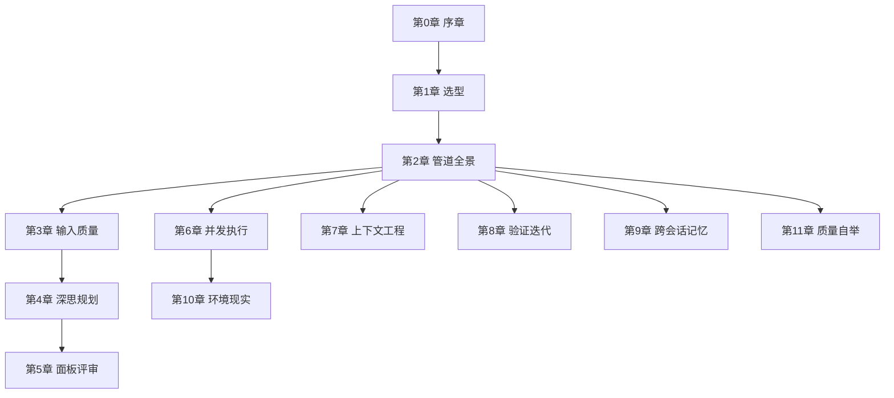

# R3 — flowkit 机制地图（教程站「机制篇」原料）

> 产出 agent: R3（机制地图绘制）| 时间: 2026-09-12 | 依据: flowkit@main（7fab746 之后工作区）
> SC5 铁律: 本笔记所有「位置」均为实读 file:line（行号为 2026-09-12 工作区快照，教程写作时需复核）。
> 只读仓库零改动（本笔记除外）。

---

## 1. 仓库结构盘点

```
flowkit/
├── README.md (328 行) / README_EN.md        # 主文档：6 张 ASCII 机制图 + 生态图引用 + 博客链接
├── CHANGELOG.md                              # v1.0.0 (2026-07-16) → v1.8.0 (2026-09-10)，版本故事线
├── CLAUDE.md / AGENTS.md                     # 仓级协作契约（谁改契约谁带测试）
├── docs/
│   ├── images/  pipeline-ecosystem.svg / multi-agent-tmux.jpg / glm-hud.jpg
│   └── deploy-new-device.md                  # 新设备部署手册（人读版，与协议同源）
├── evals/
│   ├── README.md                             # evals 三层体系总纲 + Loops 层 + signal 登记表
│   ├── trigger/  (T-302 触发竞技场)          # eval-set + results-*.json
│   ├── flow-deep/ (T-301 行为 evals)         # evals.json + grade_eval.py + benchmarks/iteration-1.json
│   └── loops/    repo-integrity-loop.md / brain-integrity-loop.md
├── scripts/
│   ├── lint_flowkit.py                       # L0 七项断言（退出码作 CI gate）
│   ├── check_integrity.py                    # 双库完整性
│   └── sync-check.sh
├── .github/workflows/lint.yml                # CI 门禁（push/PR）
└── skills/                                   # 五个 skill 本体
    ├── flow/         SKILL.md 495 行 + references/ 16 个
    ├── flow-deep/    SKILL.md 733 行 + OVERVIEW.md + references/ 21 个 + scripts/check_context.py
    ├── multi-agent/  SKILL.md 431 行 + references/ 2 个 + scripts/ 6 个（观察窗体系已退役，留存备查）
    ├── prompt/       SKILL.md 338 行 + codex-compat.md
    └── auto-skill/   SKILL.md 208 行 + knowledge-base/ + experience/（个人数据本地，仓内骨架/样例）+ references/
```

各 skill 定位一句话（README.md L25-31 核心模块表）：
| 模块 | 定位 | 亮点 |
|---|---|---|
| flow | 轻量编排引擎 | 按需启用——参数控制管道阶段 |
| flow-deep | 全量深度引擎 | 强制全开——所有关卡不可跳过 |
| multi-agent | 多 Agent 协作 | tmux 分屏并行 + 阶段间复用 |
| prompt | Prompt 评分 | 乔哈里视窗 + 3S 量化评估 |
| auto-skill | 跨会话记忆 | Stage -1 召回 + Stage 5.8 沉淀闭环 |

---

## 2. 机制清单（核心产出，九域 ~70 条）

> 讲解形态缩写: 图=图解(mermaid/ASCII/SVG) / 表=对比表 / 互=轻交互演示 / 文=纯文字
> 位置格式: `文件:行号`（skills/ 下省略前缀）

### 域 A — 编排与治理（skill 如何管住自己）

| # | 机制 | 是什么（1-2 句） | 为什么存在 | 位置 | 形态 |
|---|------|----------------|-----------|------|------|
| A1 | 设计宪法 Design Constitution | 新增任何 Stage/检查点前过四问自检：必要性/可拆性/可跳过性/控制权，另加三条铁律（编排纪律分层、宁入册不进管道、强制 Stage 必须写 why） | 重型引擎最大内在风险是膨胀接管流程、剥夺用户控制（Matt Pocock skill 哲学），宪法是反膨胀闸门 | flow-deep/SKILL.md:33-48 | 文+表 |
| A2 | 层级二分 orchestrate vs discipline | 所有能力归两层：编排层管子控制流，纪律层被注入/被调用；禁止编排互调与纪律反向劫持 | 约束调用方向，避免编排入口互相耦合 | flow-deep/references/capability-registry.md:59-96 | 图 |
| A3 | 能力注册表 + 能力发现 | C01-C42 能力索引（L1 必需/L2 代码质量/L3 思考/L4 领域/L5 安全），Stage 0 扫描 ~/.claude/skills/ 与 registry 交叉比对生成「可用能力矩阵」 | 环境能力动态变化，管道需知道本场有哪些牌可打 | flow-deep/references/capability-registry.md 全文; flow-deep/SKILL.md:212-231 | 图(已有 mermaid 关系图 registry:100-134) |
| A4 | 选型指南三入口 | 口诀「小澄清 grill-me，大工程 flow-deep，中间 flow；拿不准问做错了多难恢复」 | 防杀鸡用牛刀与能力不足两种误用 | flow/references/selection-guide.md:7-16; flow-deep/SKILL.md:117-130 | 表+互 |
| A5 | 复杂度闸门 Complexity Gate | 入口后执行级确认：单文件/低风险任务提示降级 /flow，用户坚持则只保留 Goal Contract+Minimal Plan+Verification | 选型指南是用户决策，闸门是引擎的最后一道防误用 | flow-deep/SKILL.md:191-194 | 表 |
| A6 | 环境降级协议 | 无交互通道（子代理/headless/Ralph）与依赖缺失场景统一三步降级：取推荐默认值+偏离留痕 findings+确认点汇呈报 | 2026-09 三臂 evals 发现三个执行者各自发明三种降级，收编为统一标准 | flow-deep/SKILL.md:178-186 | 图 |
| A7 | codex-compat 机制映射 | AskUserQuestion→编号选项、Plan Mode→plan 呈现+人工切换、Task 系统→.plan 文件协议、Agent→spawn_agent 族 | 一份 skill 实体多平台运行（Claude Code/Codex/dsh），缺失原语降级模拟而非砍功能 | flow/references/codex-compat.md:14-24; 各 skill codex-compat.md | 表 |
| A8 | 渐进披露（references 按需加载） | references 文件不在触发时全量加载，按 Stage 关键路径加载（Stage 0→registry+STATE；Stage 3→plan-quality；Stage 4→routing+fallback） | SKILL.md 体量控制（宪法线 500 行），上下文预算 | flow-deep/SKILL.md:103-107 | 文 |
| A9 | 单一事实来源迁移 | 本仓是 5 核心 skill 主本，~/.claude/skills 对应目录为反向 symlink；per-skill README 为导览快照 | 终结三住处拷贝漂移 | README.md:310; CHANGELOG v1.7.0 | 文 |

### 域 B — 目标与输入质量（垃圾进垃圾出的防线）

| # | 机制 | 是什么 | 为什么存在 | 位置 | 形态 |
|---|------|--------|-----------|------|------|
| B1 | Goal Contract 目标契约 | 优化/思考/规划之前先立约：Objective/Success Criteria/Constraints/Non-goals/Verification Plan/Execution Strategy 六字段写入 spec.md，后续 Stage 回看 | 防「高效执行但偏离用户真正目标」；模糊词（更好/优化）先问再规划 | flow-deep/SKILL.md:256-274; flow-deep/references/goal-contract.md:9-44 | 图+互 |
| B2 | 乔哈里视窗四象限 + 喂模式 | 按「人知/AI 知」分四象限；第四象限（人知 AI 不知）未用喂模式（举例/定义字典/RAG）则评分 ≤2 封顶 | 独有知识不喂给 AI，AI 只能瞎猜——Prompt 失败的第一大源 | prompt/SKILL.md:100-120, 300-310（决策树）; README.md:169-181 | 图+互 |
| B3 | 3S 原则 | Single 单任务/Specific 明确/Short 简洁，各有检测规则（连接词检测、格式+范围+示例分级） | 量化「写清楚了没有」 | prompt/SKILL.md:122-126 | 表 |
| B4 | 场景检测加权评分 | 四场景（简单/复杂/第四象限/学习）不同权重分布，7 维打分输出 1-10 | 不同场景的质量标准不同 | prompt/SKILL.md:128-152 | 表 |
| B5 | 四级问题诊断 | Critical/High/Medium/Low 11 种问题类型 + 检测规则（多目标混杂/约束冲突/示例不完整…） | 评分之外给出可执行的修复清单 | prompt/SKILL.md:154-186 | 表 |
| B6 | 交互节奏四律 | 多轮对话型 Prompt 专项：延迟结论/一次一问/反形式主义/信息密度判据 | 防问卷轰炸与凑数提问 | prompt/SKILL.md:187-196 | 表 |
| B7 | 需求探索双路径 | 主干明确（有实现路径/选型）→轻量 Grilling 一次一问；模糊想法（3+ 不确定项）→选项式 3-4 选项含推荐 | 误用模式会问爆用户或落入 choice architecture 陷阱 | flow-deep/SKILL.md:291-305; flow/references/needs-exploration.md | 图 |
| B8 | 结构化消歧 8 维清单 | spec.md 存在时按 8 维清单扫描 Partial/Missing 项，取 Top 5 向用户提问，回答增量写回 | spec 的静态完备性检查 | flow-deep/references/clarify-checklist.md; flow-deep/SKILL.md:338-340 | 表 |

### 域 C — 思考与规划（先想后做）

| # | 机制 | 是什么 | 为什么存在 | 位置 | 形态 |
|---|------|--------|-----------|------|------|
| C1 | Sequential Thinking 六维 | 任务分解→依赖→风险→资源→策略→**能力规划**（第 6 维与 registry 交叉做覆盖审计） | 结构化思考防跳跃；第 6 维保证能力不遗漏 | flow-deep/SKILL.md:311-335; flow/references/stage2-details.md | 图 |
| C2 | 技能匹配确认钩子 | 第 6 维匹配到 2+ 技能时 AskUserQuestion 确认（TDD+审查+并行…全部启用？） | 匹配是推断，用户可调整 | flow-deep/SKILL.md:333-336 | 文 |
| C3 | Mermaid + ASCII 双输出 | 终端不可渲染图形，一律 mermaid 代码块+ASCII 字符画双输出 | CLI 环境的用户可见性 | flow-deep/SKILL.md:342-349; flow/SKILL.md:178 | 文 |
| C4 | 三角色讨论 | 按任务类型自动选三个最相关角色，两轮讨论后综合最佳方案 | 多视角消除单角色盲区（思考阶段版） | flow-deep/SKILL.md:357-359 | 文 |
| C5 | planning-with-files 五件套 | task_plan.md/findings.md/progress.md/spec.md/STATE.md 落盘，上下文压缩或会话重启后从文件无损恢复 | 对话上下文是易失内存，文件是持久磁盘 | flow-deep/SKILL.md:372-374; flow/SKILL.md:302-305 | 图 |
| C6 | Plan Mode 纪律与反转默认 | flow 默认 --strict-plan 进只读沙箱（ExitPlanMode 审批）；flow-deep 2026-09-09 反转为默认对话内确认点，--plan-mode 才进沙箱——依据：审批弹窗属 permission prompt 无配置可抑制，bypass 下只读封锁本不强制 | 「plan 落盘+质量自检+确认点+双审查」多道关替代单弹窗，控制权留在用户 | flow-deep/SKILL.md:367-391; flow/SKILL.md:285-317 | 图+文(决策故事) |
| C7 | plan-quality Checklist | 质量标准+自检评分 ≥8/10 合格；--precise-plan 强制精确（文件路径/行号/禁止 placeholder/验证条件） | plan 的可执行性下限 | flow-deep/references/plan-quality.md; flow/references/plan-quality.md | 表 |
| C8 | Plan Review 独立审查（Stage 3.5） | 全新上下文的 Staff Engineer Agent 审 6+3 维，返回 APPROVED/APPROVED_WITH_NOTES/NEEDS_REVISION，半自动等用户确认 | 消除沉没成本偏差——第一个 Claude 花时间想方案不愿推翻，审查 Agent 没这包袱 | flow-deep/SKILL.md:406-429; flow-deep/references/plan-review.md | 图 |
| C9 | 代码级细化 agent_hint（Stage 3.7） | writing-plans 规范 + agent_hint YAML（type/subagent/files/tdd/depends_on），bite-sized 步骤无 placeholder | plan 到 Agent 指令的编译层 | flow-deep/SKILL.md:478-485; flow-deep/references/code-planning.md | 表 |
| C10 | SDD 增强（spec-template + Constitution Gates） | spec.md 存在时按 FR/US 组织 plan 生成 Coverage Matrix；宪法检查时点在 task_plan 落盘之前（准入而非补做） | 需求→计划的可追溯性 | flow-deep/SKILL.md:363-365; references/spec-template.md, constitution-checklist.md | 文 |

### 域 D — 评审与决策（Design Review Board）

| # | 机制 | 是什么 | 为什么存在 | 位置 | 形态 |
|---|------|--------|-----------|------|------|
| D1 | 多角色面板评审（Stage 3.6） | 8 角色目录（R01 架构…R08 数据），三档深度 quick(1)/basic(3)/advanced(5)，并行只读 Agent 评审，综合分析（重叠→高优，分歧→DISAGREEMENT） | 多视角交叉验证消除单角色盲区 | flow-deep/SKILL.md:431-476; flow-deep/references/panel-review.md:40-76 | 图 |
| D2 | Auto-Decide Layer | 综合分析与用户展示之间插入自动决策层，6 原则 P1-P6 逐一判定（命中即停）：行业标准→AUTO；风险分级；已批一致性；YAGNI→上浮；安全一律上浮；不可逆→上浮 | 自动处理 80% 常规发现，用户只看 Taste Decision（通常 <5 条而非 20+） | flow-deep/references/panel-review.md:192-278; README.md:82-105（ASCII 图） | 图+**互(最强候选)** |
| D3 | Taste Decision 分类 | 五标签 [CLOSE_APPROACH]/[YAGNI]/[SECURITY]/[IRREVERSIBLE]/[DISAGREEMENT]，每项含背景/来源/选项/推荐 | 上浮项的可决策结构 | panel-review.md:280-288 | 表 |
| D4 | Final Approval Gate | 只展示 Auto-Decide 摘要+Taste Decisions+Blocked Issues 三块，用户三选（APPROVE_ALL/SELECTIVE_ADOPT/REVISE_PLAN） | 决策疲劳治理——审查报告全文进 findings 可追溯，用户界面只留必须决策的 | flow-deep/SKILL.md:460-467; panel-review.md:322-333 | 图 |
| D5 | 3.5 vs 3.6 二分心智模型 | 3.5 对标原生 /review（单 Agent 广度优先 sanity check），3.6 对标 /code-review level（分级多智能体深度） | 「单次快速 vs 分级多智能体」的职责分工 | flow-deep/SKILL.md:413, 439; panel-review.md:30-38, 57 | 表 |

### 域 E — 执行与并发（multi-agent 工程）

| # | 机制 | 是什么 | 为什么存在 | 位置 | 形态 |
|---|------|--------|-----------|------|------|
| E1 | Execution Router | Stage 4 ≠ 固定 multi-agent：按任务选串行/multi-agent/Workflow（+worktree 隔离），Workflow Fit Gate 要求说明为何 Workflow 更合适 | 编排成本与收益匹配 | flow-deep/SKILL.md:487-505; references/workflow-script-patterns.md | 表 |
| E2 | Workflow Script Patterns | Review/Execution/Verification/Loop-until-dry 四模式；Input Contract：Workflow 消费澄清后产物（Goal Contract/task_plan/findings）而非原始意图 | 确定性 pipeline 控制流的模板化 | flow-deep/references/workflow-script-patterns.md:5-30 | 图 |
| E3 | Fast Path vs Full Path 风险路由 | 按任务性质（只读 vs 写入）分流：只读走 Fast Path（轻量上下文→分片→一行预告→直接分发→勾销）；写入走 Step 0-5 完整方案确认 | 一句话 fan-out 期待立刻派出，不是方案评审 | multi-agent/SKILL.md:40-65 | 图 |
| E4 | 判定行显式锚点 | 分发前必须写出「路由判定: 只读→Fast Path」「执行模式判定: IN_TMUX→tmux-split」等判定行；跳过检测≠NO_TMUX | 防流程步骤被静默跳过（2026-08-21 实测跳过检测直接降级） | multi-agent/SKILL.md:44-46, 217-228; flow/references/agent-dispatch.md:5-11 | 文 |
| E5 | nothing missed 分片覆盖验收 | 任务分解为互斥且完备分片，显式列出清单；每个 agent 返回后逐项勾销，未覆盖 SendMessage 补查 | 分片有遗漏汇总必有遗漏——fan-out 的验收落点 | multi-agent/SKILL.md:57-65 | 图 |
| E6 | digs deep 三要点 | 穷尽分片不抽样/结论带证据锚点（file:line/URL，无锚点标「推测」）/深挖优先于罗列 | 广而浅的清单是 fan-out 的伪交付 | multi-agent/SKILL.md:67-73, 377-380 | 表 |
| E7 | 规模档位与并发硬约束 | small(1-2)/medium(3 默认)/large(分批每批≤3)；预算公式：有效并发=主会话(恒1)+运行中 subagent+其他活跃会话；429/1302 后暂停分发+主 Agent 接管+退避恢复 | GLM 速率限制实测（6 并发触发 429；4 并发+主会话同触发 2026-08-24；2026-09-11 上调 2→3） | multi-agent/SKILL.md:142-158; flow-deep/SKILL.md:507 | 表+**互** |
| E8 | tmux 分屏 named-only | tmux 内一律 Agent(name=...) 命名分发，harness 自动分配 pane（独立 CC 进程真交互 UI）；观察窗体系（spawn-pane/watch-agent/reap-panes）2026-08-31 退役 | 零脚本零解析的过程可视化；二手摘要观察窗复杂度高价值低 | multi-agent/SKILL.md:258-278 | 图 |
| E9 | 静默降级（无分屏并发） | NO_TMUX 或 pane 故障→不提示安装 tmux 不重试，直接无分屏并发；能力不打折 | tmux 是可视化增强不是能力前提，提示安装打断任务流 | multi-agent/SKILL.md:280-290; agent-dispatch.md:22-29 | 文 |
| E10 | tmux 两级检测 | ①`[ -n "$TMUX" ]` ②为空时沿 PPID 祖先链找 tmux 进程 | background job 会丢 $TMUX，变量为空≠不在 tmux（2026-08-24 实测） | multi-agent/SKILL.md:106 | 文 |
| E11 | 预信任 cwd（pretrust-cwd.sh） | 派发前跑脚本向 ~/.claude.json 的 projects.<路径>.hasTrustDialogAccepted 注入信任（双键位：cwd+git 主仓根，原子写+备份） | named agent pane 是独立 claude 进程，未信任路径弹 trust 弹窗卡 N 个 pane（2026-09-01 FDNote 实测） | multi-agent/SKILL.md:229-256; scripts/pretrust-cwd.sh | 图 |
| E12 | 完成即总结即收 | 完成通知到达即三步：主会话总结进度（成果验收）→TaskStop(name) 收本体→tmux list-panes 验证消失 | teammate 完成后进程常驻 mailbox 不退出，不收则 pane 泄漏（实测挂 7 分钟） | multi-agent/SKILL.md:266-271 | 图 |
| E13 | 多阶段续接裁决门 | 已确认还有下阶段→不收本体 SendMessage 续派复用 pane；确认不复用→立即 TaskStop | Phase 间复用省重建开销，但须先过裁决门避免与完成即收打架 | multi-agent/SKILL.md:331-344 | 图 |
| E14 | Delegate 模式 | 主 Agent 是 Coordinator 不是 Implementor：分配/追踪/协调/汇总；禁止自己写业务代码、抢占编辑 | 编排与实现分离，控制流清晰 | multi-agent/SKILL.md:317-329 | 表 |
| E15 | 冲突解决矩阵 | 文件/设计/依赖/进度阻塞/崩溃循环五类，预防+处理两列；单 agent 连续 2 次崩溃→主 Agent 串行接管 | 多 agent 并行的故障模式预案 | multi-agent/SKILL.md:346-354 | 表 |
| E16 | 权限与作用域自检 | 派发执行型 agent 前两项：写入作用域扫描（additionalDirectories 外路径先 /add-dir 或改规划）+权限模式确认（default 模式 subagent 每写必弹且批准不落盘） | 后台 subagent 的授权等待没有面板提示，比弹给主会话更难发现 | flow-deep/SKILL.md:526-533; agent-dispatch.md:51-90（含弹窗诊断表） | 表 |
| E17 | Agent 与 Pane 三层清理 | 即时清理（completed 且不复用→TaskStop/kill pane）→Phase 间孤儿清理→全局清理（倒序 kill+验证仅剩主面板）；适用 Stage 0-5 全部分发点（含评审型 agent） | mailbox 型 agent 完成后静默 idle 不自动退出（panel 五席实测教训） | flow-deep/SKILL.md:554-562; flow/references/cleanup-procedure.md | 文 |
| E18 | 技能路由矩阵 + 双 Agent TDD | agent_hint.type→路由表注入指令；代码实现走双 Agent TDD（测试编写 Agent A→实现验证 Agent B） | prompt 注入的确定性与 TDD 的角色分离 | flow-deep/references/skill-routing.md:17-135 | 图 |
| E19 | Agent Prompt 模板六段 | 任务/项目上下文/文件边界（可编辑/只读/禁止）/接口约定/深度要求/完成标准 | 分片边界与验收前置 | multi-agent/SKILL.md:356-384 | 表 |
| E20 | 角色映射动态发现 | 任务类型→角色→subagent_type 映射表仅为参考，首选当前会话可用 agent types 清单匹配，不可用降级 general-purpose | 引用不存在的 type 会让 Agent 调用直接失败（2026-08-26 校准） | multi-agent/SKILL.md:109-132 | 表 |
| E21 | 协作式方案生成 | 直接输出完整方案草案（队友/文件/依赖/执行步骤+执行模式行）→用户微调→确认，而非逐项确认 | 减少确认轮次 | multi-agent/SKILL.md:160-195 | 文 |
| E22 | 方案评分检查 | 五维（任务清晰 25%/角色匹配 25%/文件分配 15%/依赖 15%/上下文完整 20%）+Critical 检测（角色不匹配/同文件多队友/资源未安装） | 方案自检 | multi-agent/SKILL.md:197-213 | 表 |
| E23 | C36 双图路由（codegraph × serena） | 多仓任务环境检验+准备分档+四段式路由（探索优先 codegraph 定位、修改规划按四段式） | 多仓/跨文件任务的索引与编辑分工 | flow-deep/references/multi-repo-toolchain.md; SKILL.md:371 | 图 |

### 域 F — 上下文工程（长任务的命脉）

| # | 机制 | 是什么 | 为什么存在 | 位置 | 形态 |
|---|------|--------|-----------|------|------|
| F1 | STATE.md 活记忆 | <80 行跨会话持久化文件（Run ID/Current Position/Phase Progress/Decisions Log/Session Continuity/Next Action），「读取一次即知当前位置」 | 上下文被 /clear 或溢出重置后能从精确位置恢复而非从头再来（借鉴 GSD） | flow-deep/references/context-management.md:31-124; README.md:112-136 | 图 |
| F2 | Run ID 命名空间 | 每次运行唯一 ID（flow-deep-YYYYMMDD-HHMM-slug），多 feature（.plan-feat-<name>/）隔离串台 | 借鉴 OTel workflow.run_id 的运行实例可追溯 | context-management.md:37 | 文 |
| F3 | 恢复协议 | 检测到 STATE.md→展示中断位置→按 Stage 分路径恢复（0-2 重做/3 重新规划/4 从 Phase Progress 继续/5 重新验证） | 不同 Stage 对上下文的依赖度不同 | context-management.md:103-115; flow-deep/SKILL.md:195-199 | 图 |
| F4 | Context Guard 容量检测 | check_context.py 读 transcript 最后一条 usage（input+cache_read+cache_creation+output）÷窗口=百分比——真值非模型自估；模型无法自感 context 占用 | 70% 阈值四选项弹窗（保存并继续/保存并交接/跳过/交接并记住自动） | flow-deep/SKILL.md:156-174; context-management.md:138-168; scripts/check_context.py 头注释 | 图+**互** |
| F5 | Auto Handoff 自动交接 | armed 状态下 75% 实测即跳过弹窗执行完整交接：五件套+HANDOFF.md→tmux new-window spawn 续接会话（CLAUDE_CODE_FORCE_SESSION_PERSISTENCE=1）→旧会话输出移交报告；--handoff-max 默认 3 代防无限接力 | context rot：越满越差直到 auto-compact 粗暴压缩；STATE.md 解决「断了怎么接」，Auto Handoff 解决「在最佳时机主动断」 | context-management.md:178-219; README.md:142-163 | 图(README 已有)+互 |
| F6 | HANDOFF.md 模板 | 不复制五件套内容只引导新 agent 按序去读（重复内容会随进度过期，路径引用不会）；即新会话初始 prompt | 可控交接的最小载体 | context-management.md:221-251 | 文 |
| F7 | 压缩矩阵 | Stage 2 输出压缩 70%/3.7 压缩 90%（agent_hint 摘要）/Stage 4 中间结果 85%，各有模板与符号系统（✅🔄❌→∴∵） | 继续本会话时的续命手段（与 checkpoint 存档互补，弹窗决策先于压缩） | context-management.md:264-340 | 表 |
| F8 | 不可压缩清单 | Phase 定义与完成标准/agent_hint 的 files-test-depends/当前 Agent prompt/Stage 5 完整清单四类必须完整 | 压缩的底线 | context-management.md:380-387 | 表 |
| F9 | 检测失败静默降级 | check_context.py exit 2 时不阻塞管道，降级回原压缩矩阵 | 检测工具自身不能成为单点故障 | flow-deep/SKILL.md:172; context-management.md:152 | 文 |

### 域 G — 验证与迭代（不达证据不罢休）

| # | 机制 | 是什么 | 为什么存在 | 位置 | 形态 |
|---|------|--------|-----------|------|------|
| G1 | Iron Laws 四铁律 | IL-1 无失败测试不写生产代码 / IL-2 无新鲜证据不宣布完成 / IL-3 无根因不改代码 / IL-4 审查只读永不修改 | Agent 能力强但缺纪律：跳过验证、用「应该可以」宣布完成——铁律是不可协商纪律 | flow-deep/references/iron-laws.md 全文（IL-1:13-37, IL-2:40-67, IL-3:70-100, IL-4:103-131）; README.md:51-76 | 图+表 |
| G2 | Rationalization Table | 每条铁律配红旗话术表（「太简单不需要测试」「应该能工作」「just this once」→为什么是绕过→正确做法），内部推理出现即停 | LLM 自我辩解跳过纪律是主要失效模式 | iron-laws.md:22-33, 52-62, 83-93, 113-124 | 表+**互** |
| G3 | Delete-Means-Delete | 发现先写实现没验证测试失败→删除实现代码，从 RED 重新开始 | 纪律崩塌的强制复位 | iron-laws.md:35-37 | 文 |
| G4 | 3 次假设规则 | 调试中连续 3 次假设失败→停下重新描述问题/收集信息/上报 blocker | 连续失败说明方法论有问题，不是运气不好 | iron-laws.md:94-100 | 文 |
| G5 | Goal Verification 证据表（Stage 5） | 逐条核对 Goal Contract 的 Success Criteria，输出「标准×证据×状态」三列表；完成态只有 DONE/PARTIAL/BLOCKED 三种；任一 Fail 不能 DONE | 防止「命令通过≠目标达成」的验证错位 | flow-deep/SKILL.md:587-613; references/stage5-verification.md; goal-contract.md:71-73 | 表 |
| G6 | Never weaken assertions to go green | 验证不过时禁止放松成功标准/删验证项/降断言制造通过；放松只在契约确实变了时合法且须证据确认；失败先分诊（真失败/过期标准/环境问题） | 「制造绿色」是验证机制的自毁 | stage5-verification.md:27 | 文 |
| G7 | Spot-check 三项 | 每 Phase 后：文件存在？git log 有新提交？测试通过附输出？ | Phase 间产出的快速确认 | flow-deep/SKILL.md:545-552; iron-laws.md:63-67 | 表 |
| G8 | Fallback 退回 Plan 协议 | 异常二分：执行偏差→直接修继续；Plan 假设有误→六步（暂停→记录→分析影响→更新 Plan→用户确认→继续）；同一 Phase 2 次 Fallback→退回 Stage 2；附能力缺口视角（卡住=缺能力，补齐而非更努力） | 执行中硬推就地修会导致连锁错误；第一反应是「Plan 哪里假设错了」 | flow-deep/references/fallback-protocol.md 全文（决策树:10-30，六步:55-141）; README.md:185-208; flow/SKILL.md:398-404 | 图 |
| G9 | auto-iterate keep/revert 循环 | 每次一个聚焦变更→机械验证→通过 keep 失败 revert；参数从 Stage 5 失败项自动构造（scope/metric/verify_cmd/baseline/target/direction） | 结构化迭代而非盲目重试 | flow/references/stage55-iteration.md:14-42; flow-deep/SKILL.md:615-628 | 图 |
| G10 | 渐进式 Guard | 前 1/3 仅 verify（探索期）/中 1/3 轻量 guard/后 1/3 全量 guard（精调期） | 全量 guard 太早会扼杀创新方向探索 | stage55-iteration.md:27-33 | 图 |
| G11 | 迭代终止语义 | 用尽 N 轮不是失败而是决策点：持续改善→问用户追加；停滞震荡→退回 Stage 3（plan bug 假设）；恶化→revert+退回 | 「反复失败=plan bug，不是意志力问题」；误锁与暴力续跑都错 | stage55-iteration.md:50-62 | 表 |
| G12 | on-the-loop 异步纠偏 | 迭代运行中用户随手一句纠正→写入 .plan/loop-memory.md 不打断循环→后续每轮开始时读取生效；区别于 in-the-loop（阻断改变当前轮） | 阻断式确认点之外缺一条非阻断通道（源自 humanlayer design-control-loop） | stage55-iteration.md:64-74 | 图 |
| G13 | Ralph Loop 强制持续 | Stop Hook 拦截会话退出，注入启动时写入的一次性固定 prompt（含初始 TSV 历史+「自行从 progress.md 读最新状态」指令）；Completion Promise 达标输出 `<promise>` 退出 | auto-iterate 用完仍未达标时的「不达目的不罢休」外层包裹 | flow-deep/SKILL.md:630-652; references/ralph-integration.md:7-16, 43-105 | 图 |
| G14 | 一次性 prompt + 自主状态获取 | Ralph 每轮注入同一份 prompt，LLM 每轮先 cat STATE.md/progress.md 获取最新态 | stop-hook 不支持动态更新 prompt 的约束变通 | ralph-integration.md:43-91 | 文 |
| G15 | 历史摘要压缩策略 | 1-10 轮全量/11-20 加趋势/21-50 最近 10 轮+汇总/50+ 最近 5 轮+分阶段汇总 | 长 TSV 历史的上下文预算 | ralph-integration.md:107-116 | 表 |
| G16 | auto-iterate vs Ralph 二分 | 前者是应用逻辑层（有纪律有记忆的怎么迭代），后者是会话控制层（只是不让停）；Ralph 内层仍调 keep/revert | 两层不混淆：没有 auto-iterate 的 Ralph 是无结构的「继续试」 | flow-deep/OVERVIEW.md:111-122 | 表 |

### 域 H — 跨会话记忆（auto-skill 闭环）

| # | 机制 | 是什么 | 为什么存在 | 位置 | 形态 |
|---|------|--------|-----------|------|------|
| H1 | 核心循环五步 | 每回合：抽 3-8 关键词→判话题切换→跨技能经验读取（用过非 auto-skill 技能必读其经验）→话题切换才读知识库→任务完成主动询问记录 | 经验不沉淀，下次同场景从零开始 | auto-skill/SKILL.md:12-102 | 图 |
| H2 | 自举协议（0.5） | 首次触发时检查全局规则文件是否含「任务启动协议」，无则自动追加 | 协议的永久生效不依赖手动配置 | auto-skill/SKILL.md:16-36 | 文 |
| H3 | 对话内缓存 | last_keywords/topic_fingerprint/last_matched_categories 等，非话题切换不重读索引 | 省 token 与时间 | auto-skill/SKILL.md:38-46 | 文 |
| H4 | 话题切换判定 | 转折词/关键词差异 ≥40%/用户要求改分类三条件 | 读档的触发器 | auto-skill/SKILL.md:52-56 | 文 |
| H5 | Stage -1 强制召回 | flow-deep 启动时从任务表述抽关键词，匹配双库 _index.json，命中条目全文加载，Goal Contract 增加 Relevant History 字段 | auto-skill 的话题切换判断可能漏载任务相关经验——管道层强制补充（读端） | flow-deep/SKILL.md:233-254 | 图 |
| H6 | Stage 5.8 验证后沉淀 | Goal Verification 为 DONE 才触发：从 Success Criteria+执行结果+关键决策提炼，分流 knowledge-base/experience，询问用户后写入并更新 _index.json | 只在验证通过后沉淀，避免把失败方案存成误导（写端） | flow-deep/SKILL.md:654-677 | 图 |
| H7 | 陈旧度标注（REC-1） | 条目记 lastUpdated+subject_version；召回时距今 >90 天或版本不符→提示行附标注（过期不静默） | 过期经验按新知识用会翻车（codegraph staleness banner 思想） | auto-skill/SKILL.md:66, 92-93, 141-143 | 文 |
| H8 | 交叉授粉（REC-3） | 沉淀时可选记 consumed_by+[[条目名]] 互链，召回命中时顺带提示同族条目 | 经验孤岛→条目关系图（AIBC compounding 最小移植） | auto-skill/SKILL.md:94 | 文 |
| H9 | Evidence-backed 条目格式 | experience 条目含 Trigger（什么场景触发）/Observation（观察到的事实）/Outcome（验证效果）——从结论变证据链 | 用户可快速判断经验可信度（有验证 vs 仅推测） | auto-skill/SKILL.md:155-176 | 表 |
| H10 | 记录判断准则 | 核心问题「下次能让用户省时间吗」；general 七该记四不该 / experience 五该记三不该 | 防经验库变垃圾场 | auto-skill/SKILL.md:105-138 | 表 |
| H11 | 双库分工 | knowledge-base（通用流程/偏好/解法）vs experience（技能踩坑/参数/模板），各有 _index.json 索引召回 | 两类知识的检索面不同 | auto-skill/SKILL.md:180-186; README.md:31 | 图 |
| H12 | 隐私设计 | 个人经验数据本地维护，仓库只含协议与骨架（gitignore 隔离） | 开源协议与私人记忆分离 | README.md:31; docs/deploy-new-device.md 前置认知表 | 文 |

### 域 I — 质量自举（管道验证一切，唯独不验证自己）

| # | 机制 | 是什么 | 为什么存在 | 位置 | 形态 |
|---|------|--------|-----------|------|------|
| I1 | evals 三层体系 | L0 静态断言（lint 七项+CI）/ L1 触发层（should/should-not near-miss）/ L2 行为层（stage 纪律/五件套落盘/handoff 断链），成本与覆盖分级 | Stage 5 验证一切但不验证 skill 本体——evals 是 skill 的回归测试 | evals/README.md:7-18 | 图 |
| I2 | 单臂回归结构 | L2 用单臂迷你任务+Stage 3 截断起步，双臂对照降为可选背书件（baseline 缓存复用）；成本 ≈原案 1/15 | 全量双臂太贵，日常回归要跑得起 | evals/README.md:15-18 | 文 |
| I3 | 五条防漂移规则 | 断言只锚不变量/谁改契约谁带测试/评测集是活水/held-out 小集防刷题/环境三元组（flowkit×CC×模型版本）钉住 | 区分「任务变化」（白给的多样性）与「契约变化」（真威胁），eval 有效性闭环 | evals/README.md:20-35; CLAUDE.md | 表 |
| I4 | lint 七项断言 | L1 废弃 API/L2 registry 一致性/L3 体量（500 宪法线-800 budget 线）/L4 验证命令标记/L5 引用完整性/L6 codex-compat 双向/L7 frontmatter；报错信息内嵌修复指引 | 人类品味捕获一次，机械检查处处强制（Legible-b custom lints） | scripts/lint_flowkit.py:1-25; .github/workflows/lint.yml | 表 |
| I5 | Loops 层 + signal 登记总表 | repo-integrity（CI cron 每周一 lint）/brain-integrity（双库监守）两个 loop contract；五条跨 loop 边显式登记（写者×读者×载体） | 任务与 loop 是两种本体正交共存；边要有登记才有事实 | evals/README.md:43-62 | 表 |
| I6 | T-302 触发竞技场 | 两轮实测：负向边界零误触发（precision 稳健）、自然语言主动触发弱且高方差；方法局限注记（command 注入≠真实 skill 机制） | description 是唯一常驻上下文=触发机制，需实测 | CHANGELOG v1.7.0; evals/trigger/ | 文 |

**机制总数：~70 条（A9 + B8 + C10 + D5 + E23 + F9 + G16 + H12 + I6 = 98 个编号，其中部分是同一机制的分面；去重后核心机制约 60-70 个）**

---

## 3. 已有资产盘点（可直接入站）

### 3.1 图片资产（直接复用）

| 资产 | 位置 | 用途 | 质量 |
|---|---|---|---|
| pipeline-ecosystem.svg | docs/images/ | 生态关系总图（双引擎+能力位+记忆流），README L15 已用 | 高，站首页/首章直接嵌入 |
| multi-agent-tmux.jpg | docs/images/ | 真机 tmux 分屏实录（README 顶图 L9） | 高，效果展示章 |
| glm-hud.jpg | docs/images/ | 状态栏额度监控截图（README L43） | 中，伴生工具介绍 |

### 3.2 README 内嵌 ASCII 图 ×6（改绘为站内 mermaid/交互图的底稿）

| 图 | README 行号 | 对应机制 |
|---|---|---|
| Iron Laws 四象限图 | 51-76 | G1 |
| Auto-Decide Layer 判定图 | 82-105 | D2 |
| STATE.md 恢复流程图 | 112-136 | F1/F3 |
| Auto Handoff 双窗接力图 | 142-163 | F5 |
| 乔哈里视窗四象限 | 169-181 | B2 |
| Fallback 决策树 | 185-208 | G8 |

### 3.3 文档资产（内容再加工源）

| 资产 | 位置 | 教程价值 |
|---|---|---|
| flow-deep/OVERVIEW.md | 178 行 | 管道对比表（L14-30）/Iron Laws 表（L85-94）/auto-iterate vs Ralph 表（L111-122）——现成的对比表素材 |
| 各 skill README 导览层 | skills/*/README.md（2026-09-09 生成） | **SC5 式 file:line 引用风格的现成范例**（教程站的锚点写法直接抄这个风格） |
| capability-registry mermaid 关系图 | registry:100-134 | 能力关系图（REC-4）直接嵌入 |
| multi-agent SKILL.md mermaid 架构图 | SKILL.md:27-38 | Fast/Full 路由图底稿 |
| docs/deploy-new-device.md | 部署手册 | 上手章的安装节素材（含三阶段十步+三大坑） |
| evals/README.md | 体系总纲 | 质量自举章主素材 |
| CHANGELOG.md | v1.0→v1.8 | 版本故事线（机制演化叙事：如 Plan Mode 反转默认 2026-09-09、观察窗退役 2026-08-31、上限 2→3 2026-09-11——每个机制都有「为什么变成今天这样」的故事） |
| .plan/linuxdo-post-*.md | 社区发帖草案（415 行） | 站外叙事参考（不入站；推广口径可借鉴） |
| 博客深度解读 | michaelmaomao.github.io 2026/05/05 FlowKit（README L3） | 站外链接挂靠；设计动机叙事参考 |
| README_EN.md | 英文版 | 若做双语站的底稿 |

### 3.4 缺口（需新制作）

- 管道 Stage 全景交互图（现有的是文字流程图，无交互版）
- flow vs flow-deep 参数开关可视化（README 只有对比表 L212-221）
- Stage 0-5 端到端时序图（单次 /flow-deep 调用的完整走查）
- auto-skill 读-写闭环图（Stage -1/5.8 与双库的关系图，散落两处未成图）

---

## 4. 章节草案（11 章）

> 每章: 标题 / 覆盖机制（编号见上表）/ 前置章 / 主打形态

| 章 | 标题 | 覆盖机制 | 前置 | 主打形态 |
|---|------|---------|------|---------|
| 0 | 序章：Agent 很强，但缺纪律 | 为什么造轮子（README L19-21）、五模块地图（A 域导览）、安装上手 | — | 图（pipeline-ecosystem.svg + tmux 实录） |
| 1 | 三入口选型：flow / flow-deep / grill-me | A4 选型口诀、A5 复杂度闸门、预设参数（flow/SKILL.md:206-210） | 0 | **互：参数开关面板** |
| 2 | 管道全景：Stage -1 到 5.8 的一条龙 | 双引擎 Stage 对比、A1 设计宪法、A2 层级二分、A3 能力注册表、A8 渐进披露 | 1 | **互：Stage 步进器**（点击展开+file:line） |
| 3 | 输入质量：Goal Contract 与 Prompt 评分 | B1-B8（目标契约六字段、乔哈里+喂模式、3S、四级诊断、节奏四律、双路径探索、8 维消歧） | 2 | **互：乔哈里评分演示** + 图 |
| 4 | 深思与规划：五件套与独立审查 | C1-C10（ST 六维、三角色、五件套、Plan Mode 反转故事、plan-quality、Plan Review 沉没成本、agent_hint、SDD） | 3 | 图 + 文（决策故事） |
| 5 | 评审与决策：面板与 Auto-Decide Layer | D1-D5（8 角色×三档、P1-P6 判定链、Taste Decision、Approval Gate、3.5/3.6 二分） | 4 | **互：Auto-Decide 判定模拟器**（最强候选） |
| 6 | 并发执行：multi-agent 的分片与治理 | E1-E23（Fast/Full 路由、分片验收、digs deep、规模档位与 429 预算、tmux named-only、判定行、pretrust、完成即总结即收、续接、Delegate、冲突矩阵、权限作用域、双 Agent TDD） | 2 | **互：429 并发预算计算器** + 图 + 表 |
| 7 | 上下文工程：STATE.md 与 Auto Handoff | F1-F9（活记忆、恢复协议、check_context.py 真值、四选项、75% 接力、HANDOFF、压缩矩阵、不可压缩清单） | 2 | 图（README 双图改绘）+ **互：Context 仪表盘模拟** |
| 8 | 验证与迭代：铁律到 Ralph Loop | G1-G16（四铁律+Rationalization、证据表、Fallback、keep/revert、渐进 Guard、终止语义、on-the-loop、Ralph） | 2 | **互：红旗话术识别小测** + 图 |
| 9 | 跨会话记忆：召回-沉淀闭环 | H1-H12（五步循环、自举、话题指纹、Stage -1/5.8、陈旧度、交叉授粉、evidence-backed、双库、隐私设计） | 2 | 图（读写闭环图，需新制作） |
| 10 | 环境的现实：降级、兼容与异常 | A6 环境降级协议、A7 codex-compat 映射、E9 tmux 静默降级、E11 pretrust、F9 检测失败降级、G8 Fallback（执行侧详述） | 6 | 表（机制映射表）+ 图（决策树） |
| 11 | 质量自举：evals 与 lint | I1-I6（三层体系、五条防漂移、七项断言、Loops 层、触发竞技场） | 2 | 表 + 文 |

依赖关系（mermaid）：

（第 2 章是原理枢纽——5 个分支章都只依赖它，可并行写作/并行阅读。）

---

## 5. 叙事线判断（两类读者）

**画像**：
- P1「想学会用 flowkit 的用户」：关心安装、何时用哪个、参数怎么填、出问题怎么办。要「30 秒能上手，5 分钟能跑通」。
- P2「想理解 agent 工程原理的学习者」：关心机制为什么存在、解决什么 agent 工程问题（context rot/沉没成本偏差/自我辩解/决策疲劳…）、能否迁移到自己的系统。不装 flowkit 也想读。

**判断：单主干 + 章内双轨，不分篇**。理由：

1. flowkit 的「用法」本身就是机制的呈现形式（参数=机制开关），分篇必然内容重复、双份维护，违反 SC5 单一事实来源精神。
2. 第 0-1 章天然 P1 向（上手），第 2 章起每章采用统一双轨结构：
   - **章首「怎么用」侧栏**（P1 轨）：本机制的调用方式/参数/最小示例，3-5 行 + 链接到 skill 源 file:line
   - **主体「为什么」**（P2 轨）：问题→机制→证据（实测教训/设计决策故事，CHANGELOG 里有丰富素材）
   - **章尾 SC5 锚点表**：本章每个断言对应的 skills 源 file:line（教程幻觉防火墙）
3. P1 读者的动线：0→1→各章侧栏（跳读）；P2 读者的动线：0→2→按兴趣分支。第 2 章「管道全景」是两者共同的枢纽。
4. 每个「实测教训」都是天然的好叙事（trust 弹窗卡 pane 7 分钟、6 并发触发 429、panel 五席 idle 未清、三臂 evals 各自发明降级）——这些故事同时服务两类读者，是 flowkit 区别于纯理论教程的差异化资产，建议每章至少一个。

---

## 6. 轻交互 TOP5（按可行性×机制代表性排序）

| # | 交互组件 | 对应机制 | 交互设计 | 可行性 |
|---|---------|---------|---------|--------|
| 1 | **Auto-Decide 判定模拟器** | D2 (P1-P6) | 用户输入/选择一个评审发现项（预设 8-10 个案例），逐步走 P1→P6 判定链，每步高亮命中原则，终点亮出 AUTO_APPROVED/TASTE_DECISION[BLOCKED] | 极高——纯逻辑链，判定规则全在 panel-review.md:197-278，零框架可实现 |
| 2 | **管道 Stage 步进器** | 第2章全景 | Stage -1→5.8 横向时间轴，点击每个 Stage 展开：做什么/为什么/跳过条件/对应 SKILL.md 行号；flow 与 flow-deep 双轨高亮差异 | 极高——数据结构简单（两份 Stage 表已有：OVERVIEW.md:14-30） |
| 3 | **flow vs flow-deep 开关面板** | A4/A5/双引擎对比 | 勾选参数（--think/--panel/--iterate/--ralph…），实时渲染启用的 Stage 序列与默认值变化 | 高——参数速查表（flow:182-210, flow-deep:710-721）即数据源 |
| 4 | **乔哈里 Prompt 评分演示** | B2/B3 | 贴一段 prompt → 象限判定问答（限定词检测）→ 展示喂模式改造前后对比（预设案例 + 自由输入简化版） | 高——本地规则判定即可，不必真调模型（标注「简化演示」） |
| 5 | **429 并发预算计算器** | E7 | 滑块输入主会话数/运行中 subagent/其他活跃会话 → 实时算有效并发，≥3 变红并给出处置建议（暂停分发/主 Agent 接管/退避） | 高——公式一行：1+subagent+其他会话 |

备选：STATE.md 断点恢复模拟（F1/F3，多步情景剧式）、Fallback 决策树漫步（G8，二选一闯关）、红旗话术识别小测（G2，翻牌配对）。

---

## 7. 复核提醒（写作时必做）

- 行号快照日期 2026-09-12，教程落笔前对每条 file:line 重跑一次 `sed -n 'Xp'` 复核（仓库活跃，v1.8.0 刚发）。
- multi-agent/SKILL.md:64-65 存在重复编号（两个第 5 步「汇总核对」），引用该节时注意。
- flow-deep/SKILL.md:522 与 flow/SKILL.md:394 的并发上限表述（≤3 vs ≤4）有历史演进痕迹，以 multi-agent/SKILL.md:152-158（2026-09-11 上调 2→3）与全局 CLAUDE.md（≤3）为准——教程中应讲这条演化线而非回避。
- 「观察窗体系已退役」：multi-agent/scripts/ 下 6 个脚本留存备查但主流程不引用（multi-agent/SKILL.md:276），教程勿把它们当活机制讲。
