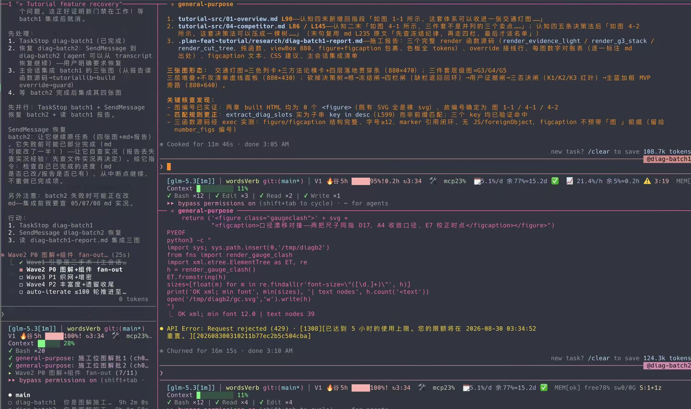
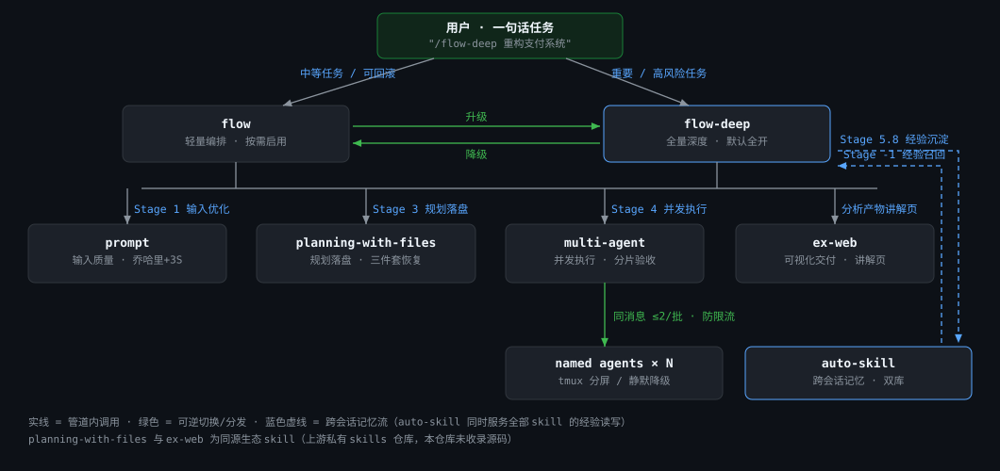
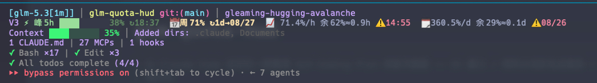

# FlowKit

> **📝 博客深度解读**: [FlowKit: AI 原生工作流编排工具集](https://michaelmaomao.github.io/2026/05/05/FlowKit-AI%E5%8E%9F%E7%94%9F%E5%B7%A5%E4%BD%9C%E6%B5%81%E7%BC%96%E6%8E%92%E5%B7%A5%E5%85%B7%E9%9B%86/) —— 设计动机、核心架构、设计决策与踩坑经验详解

> AI 原生工作流编排工具集 —— 从任务分析到验证交付的结构化管道，75% 上下文自动交接让长任务跨会话不断线。

**[English](README_EN.md)** | 中文 | **[交互教程站](http://michaelMaoMao.github.io/flowkit/)**——机制原理 11 章 + 可交互演示（线上版）; 仓内 [site/](site/) 为源码（本地预览 `cd site && python3 -m http.server`）



> 真机实录 —— 主会话派发 fan-out 分片清单，多个 agent 在 tmux 分屏中并行施工；底部状态栏由伴生工具 [glm-quota-hud](https://github.com/FrizzleFur/glm-quota-hud) 实时盯守 GLM 额度与 Context 余量。

## Pipeline 架构总览



> **读图**：实线 = 管道内调用，绿色 = 可逆切换/分发，蓝色虚线 = 跨会话记忆流。双引擎（flow / flow-deep）在管道各阶段调用专项能力位——Stage 1 输入质量（prompt）、Stage 3 规划落盘（planning-with-files）、Stage 4 并发执行（multi-agent，向下分发 named agents）；auto-skill 在管道首尾（Stage -1 召回 / Stage 5.8 沉淀）提供跨会话经验闭环；ex-web 把分析产物转成给人看的讲解页。planning-with-files 与 ex-web 为同源生态 skill（上游私有 skills 仓库，本仓库未收录源码）。

## 为什么造这个轮子

使用 AI 编程助手（Claude Code、Cursor 等）的过程中发现一个核心问题：**Agent 能力很强但缺乏纪律性**。它们跳过验证、忽略边界情况、用"应该可以"来宣布完成。FlowKit 把软件工程的严谨性注入 AI Agent 工作流 —— 让"感觉驱动的编码"变成可重复的工程流程。

## 核心模块

| 模块 | 定位 | 一句话亮点 |
|------|------|-----------|
| **[flow](skills/flow/SKILL.md)** | 轻量编排引擎 | 按需启用 —— 通过参数控制管道阶段 |
| **[flow-deep](skills/flow-deep/SKILL.md)** | 全量深度引擎 | 强制全开 —— 所有关卡不可跳过 |
| **[multi-agent](skills/multi-agent/SKILL.md)** | 多 Agent 协作 | tmux 分屏并行 + 阶段间复用 |
| **[prompt](skills/prompt/SKILL.md)** | Prompt 评分 | 乔哈里视窗 + 3S 原则量化评估 |
| **[auto-skill](skills/auto-skill/SKILL.md)** | 跨会话记忆 | Stage -1 召回 + Stage 5.8 沉淀 —— 经验库闭环（个人数据本地维护，仓库只含协议与骨架） |

## 效果展示

### Multi-Agent 并行施工

顶图就是真实任务现场：主会话拆出 fan-out 分片清单（`Wave2 P0 图解+组件 fan-out (7/11)`），每个 agent 独立上下文并行深挖——单个 agent 连续施工 11 分钟交付一个完整批次，主会话只做统筹、集成与验收。tmux 分屏只是可视化增强：无 tmux 环境自动降级为无分屏并发，能力不打折。

### 伴生工具：glm-quota-hud —— 状态栏里的额度仪表盘

多 agent 并行意味着额度烧得飞快。顶图状态栏里 `V1 🔥谷5h 95% | mcp23% | 📈21.4%/h 余5%≈0.2h ⚠3:19` 的实时监控来自 [glm-quota-hud](https://github.com/FrizzleFur/glm-quota-hud) —— 把 GLM Coding Plan 双账号额度（5h 窗口 / 周积分池 / 速率预测 / 耗尽倒计时）钉在 Claude Code 状态栏，429 之前先看到：



## 设计亮点

### 1. Iron Laws —— 不可协商的执行铁律

四条规则，每条配备**合理化辩解对照表**，防止 LLM 自我辩解跳过：

```
  IL-1 · TDD                  IL-2 · Verify
  ┌────────────────┐          ┌────────────────┐
  │ No prod code   │          │ No "done"      │
  │ without failed │          │ without fresh  │
  │ test           │          │ evidence       │
  └───────┬────────┘          └───────┬────────┘
          │                           │
          ▼                           ▼
   "too simple"               "should work"
          │                           │
          └──────────┬────────────────┘
                     ▼
          ┌─────────────────────┐
          │ Rationalization Tbl │
          │ excuse -> rebuttal  │
          └─────────────────────┘

  IL-3 · Debug                 IL-4 · Review
  ┌────────────────┐          ┌────────────────┐
  │ No code change │          │ Review is      │
  │ without root   │          │ read-only      │
  │ cause          │          │ never modify   │
  └────────────────┘          └────────────────┘
```
*IL-1: 无失败测试不写生产代码 · IL-2: 无新鲜证据不宣布完成 · IL-3: 无根因确认不改代码 · IL-4: 审查只读永不修改*

### 2. Auto-Decide Layer —— 减少 80% 人工评审

多角色面板评审（Stage 3.6）中，6 条原则自动分类发现项：

```
  发现项输入
      │
      ▼
  ┌──────────────────────┐
  │   Auto-Decide Layer  │
  ├──────────────────────┤
  │                      │
  │  P1 行业标准 ────────┼── 违反 → 自动修复 (AUTO_FIX)
  │  P2 风险阈值 ────────┼── 高风险 → 修复 / 低风险 → 通过
  │  P3 一致性   ────────┼── 与已有一致 → 自动通过 (AUTO_APPROVE)
  │  P4 YAGNI    ────────┼── 过度设计 → 上浮给用户 ⚖️
  │  P5 安全优先 ────────┼── 安全相关 → 自动修复
  │  P6 不可逆性 ────────┼── 不可逆 → 上浮给用户 ⚖️
  │                      │
  └──────┬───────┬───────┘
         │       │
         ▼       ▼
   ┌──────────┐  ┌──────────────────┐
   │ 80% 自动 │  │ 20% Taste       │
   │ 处理完毕 │  │ Decision 上浮   │
   │ (静默)   │  │ 给用户决策      │
   └──────────┘  │ (通常 < 5 条)   │
                 └──────────────────┘
```

只有 **Taste Decision**（品味决策）需要人工 —— 通常 < 5 条，而非 20+ 条。

### 3. STATE.md —— 跨会话恢复

管道内置崩溃恢复机制：

```
  会话在 Stage 4 Phase 2 中断 💥
          │
          ▼
  ┌─────────────────────────┐
  │    .plan/STATE.md        │
  │                          │
  │  current_stage: 4        │
  │  current_phase: 2        │
  │  next_action: "Stage 5"  │
  │  progress: 65%           │
  └──────────┬──────────────┘
             │
             ▼
  新会话读取 STATE.md
          │
          ▼
  "上次停在 Stage 4 Phase 2
   —— 恢复还是重新开始？"
          │
          ▼
  从断点精确恢复 ──▶ 继续执行
```

GSD、GStack 等社区框架均无此能力。

### 4. Auto Handoff —— 75% 上下文自动交接，长任务不断线

长任务最大的敌人是 context rot：上下文越满质量越差，直到 auto-compact 粗暴压缩或直接溢出。Auto Handoff 让管道在 **75%** 处主动换窗续命——触发依据是 `scripts/check_context.py` 从 transcript 读到的 API usage 真值（精确检测，非模型自估）：

```
  旧会话（context ≥ 75%）                        新会话（context ≈ 14%）
  ┌───────────────────────────┐                 ┌───────────────────────────┐
  │ check_context.py 边界实测 │                 │ HANDOFF.md 即初始 prompt  │
  │          │                │                 │          │                │
  │ 五件套 + HANDOFF.md 落盘  │    tmux 窗口    │ 按序读 STATE.md 等三件套  │
  │          │                │ ───spawn────▶   │          │                │
  │ tmux new-window 接力      │                 │ 从 Next Action 精确恢复   │
  │ 移交报告后旧窗口收尾       │                 │ 继续执行，像什么都没发生   │
  └───────────────────────────┘                 └───────────────────────────┘
```

四个设计点：

- **用户控制权**：弹窗选「交接并记住自动」才进入自动状态（opt-in），偏好写入 STATE.md 由续接会话继承；`--no-auto-handoff` 随时退出
- **防失控护栏**：`--handoff-max`（默认 3 代）接力上限，杜绝无限接力环
- **可追溯**：嵌套会话以 `CLAUDE_CODE_FORCE_SESSION_PERSISTENCE=1` 启动，续接会话可被 `--resume` 追溯
- **实测闭环**：真实 tmux spawn → 新会话读 HANDOFF.md → 从 Next Action 恢复，全链路验证通过

它是 STATE.md 恢复机制的主动版：STATE.md 解决"断了怎么接"，Auto Handoff 解决"在最佳时机主动断"。

### 5. Prompt 量化评分

基于乔哈里视窗理论 + 3S 原则：

```
                AI 知道           AI 不知道
            ┌──────────────┬──────────────┐
  人知道    │ Q1 公共知识   │ Q4 独有知识 ⚠│
            │ 直接描述即可  │ 必须喂模式    │
            ├──────────────┼──────────────┤
  人不知道  │ Q2 AI 专业   │ Q3 探索创新   │
            │ 信任 AI 即可  │ 协同探索      │
            └──────────────┴──────────────┘

  Q4 未使用喂模式 → 评分 ≤ 2/10 (Critical)
  Q4 使用喂模式   → 评分 7.0-8.5/10
```

### 6. Fallback 协议 —— 遇错先问 Plan

执行中遇到意外时，第一反应不是"怎么修"，而是"Plan 哪里假设错了"：

```
  执行遇到异常
      │
      ├─ 小偏差 ────────────▶ 直接修复 ──▶ 继续
      │
      ├─ Plan 假设有误 ─────▶ Plan Fallback
      │                       │
      │                  ┌────┴────┐
      │                  ▼         │
      │              暂停执行      │
      │              记录偏差      │
      │              更新 Plan     │
      │              用户确认 ─────┘
      │                  │
      │                  ▼
      │              继续执行
      │
      └─ 同一 Phase 失败 2 次
              │
              ▼
         退回 Stage 2 重新分析
```

## Flow vs Flow-Deep

| 维度 | `/flow` | `/flow-deep` |
|------|---------|--------------|
| 前置检查 | — | 强制开启 |
| 深度思考 | 可选 (`--think`) | 强制（ST + Mermaid + 三角色讨论） |
| Plan Mode | 默认开启，可关闭 | 不可关闭 |
| Plan Review | 可选 | 强制 |
| 多角色面板 | — | 默认 3-5 角色 |
| TDD 注入 | 可选 | 自动注入 |
| 完成验证 | 可跳过 | 不可跳过 |
| Ralph Loop | 手动触发 | 迭代用完自动触发 |

## 快速上手

> **新设备部署**（FlowKit + codegraph × serena 双图工具链 → 多仓项目）：见 [docs/deploy-new-device.md](docs/deploy-new-device.md)——三阶段十步实操手册，含实测背书与三大坑。

本工具集为 [Claude Code](https://docs.anthropic.com/en/docs/claude-code) CLI 设计。

### 一行安装（推荐）

通过 [skills.sh](https://skills.sh)（Vercel Labs 的 Agent Skills 包管理器）一行安装全部模块：

```bash
npx skills add FrizzleFur/flowkit -a claude-code
```

只安装单个模块：

```bash
npx skills add https://github.com/FrizzleFur/flowkit/tree/main/skills/flow
```

### 手动安装（无 Node 环境备选）

```bash
# 复制所需模块到 Claude Code skills 目录
cp -r skills/flow ~/.claude/skills/
cp -r skills/flow-deep ~/.claude/skills/
cp -r skills/multi-agent ~/.claude/skills/
cp -r skills/prompt ~/.claude/skills/
cp -r skills/auto-skill ~/.claude/skills/
```

在 Claude Code 中调用：

```
/flow 重构认证模块
/flow-deep 重新设计支付系统，支持多币种
/prompt 评估这个提示词："写一个排序算法"
```

## 多平台支持（v1.6.1 新增）

flowkit 全家已适配 **OpenAI Codex CLI** 运行，Claude Code 体验零变化：

| 平台 | 调用 | 适配方式 |
|------|------|---------|
| Claude Code | `/flow` | 原生机制，零变化 |
| Codex CLI | `$flow` | 各技能内置 `codex-compat.md` 适配层（机制映射：AskUserQuestion→编号选项、Plan Mode→plan 呈现+人工切换、Task 系统→.plan 文件协议、Agent→spawn_agent 族） |
| DeepSeek dsh | `/flow` | 机制原生同构（ask_user_question / exit_plan_mode / hooks.json 复用），理论可用，待实测 |

安装到 Codex：把 `skills/` 下各技能目录 symlink 或复制到 `~/.agents/skills/`（Codex USER 层 skill 目录）即可，SKILL.md 格式同源于 [agentskills.io](https://agentskills.io) 开放标准。

设计原则：frontmatter 与 description 零变更（CC 触发行为不受影响）；适配内容全部下沉 reference 文件按渐进披露加载；Codex 缺失的交互原语全部降级模拟而非砍功能。

## 设计哲学

| 来源 | 管什么 | 我们吸收了什么 |
|------|--------|---------------|
| GStack | 决策流程 | Auto-Decide Layer (P1-P6 + Taste Decision) |
| Superpowers | 执行纪律 | Iron Laws + Rationalization Table |
| GSD | 上下文质量 | STATE.md 跨会话恢复 |

**原创贡献（社区框架中均未出现）：**
- STATE.md 崩溃恢复机制
- Auto Handoff 75% 上下文自动交接（tmux 接力 spawn，实测闭环）
- Auto-Decide Layer 六原则自动决策系统
- Ralph Loop 集成（Stop Hook + auto-iterate 双层迭代）
- Loop Memory 三层记录体系（TSV 记历史 / memory 存未来规则 / 经验库全局沉淀）+ on-the-loop 运行中异步纠偏
- 乔哈里视窗 Prompt 量化评分

## 更新日志 (Changelog)

> 完整版本历史（v1.0.0 起）见 [CHANGELOG.md](CHANGELOG.md)。

### v1.8.0 (2026-09-10)

**Loops 层（graph loop 吸收第一步）+ flow-deep 环境降级协议**
- 新增 **Loops 层**——`evals/loops/` 两个 loop contract + CI cron 触发：repo-integrity-loop（每周一自动跑 lint，全体系第一个挂载的定时 loop，no-op 是有效 run）与 brain-integrity-loop（本机双库监守，挂载由用户定）；signal 登记总表五条跨 loop 边显式化——任务与 loop 两种本体正交共存，单层起步不加 evolve
- flow-deep 新增 **环境降级协议**——无交互通道（子代理/headless/Ralph）与依赖缺失场景统一三步降级（推荐默认值 + findings 偏离留痕 + 确认点汇呈报）；设计依据为 T-301 三臂 evals 的行为数据，iteration-2 回归验证协议全程留痕可追溯
- Constitution Gates 时点澄清 + Stage 2 顺序说明 + 三大 reference 补 TOC（17/23/34 条目）

### v1.7.0 (2026-09-09)

**Evals 体系 + 单一事实来源（skill 本体的回归测试网）**
- 新增 **evals 三层体系**（L0 静态断言 / L1 触发 / L2 行为）——「管道验证一切，唯独不验证自己」的补位；五条防漂移规则 + 环境三元组纪律（`evals/README.md`）
- **lint 七项断言 + GitHub Actions CI 门禁**——新增引用完整性 / codex-compat 双向一致 / frontmatter 一致；零 LLM 成本，push/PR 即跑；首跑抓出并修复 2 条跨技能真断链与 1 条外部依赖误判
- **flow-deep 行为 evals（T-301）**——三类型迷你任务 × 单臂 × Stage 3 确认点截断，24 机检断言全绿建立绿基线（`benchmarks/iteration-1.json`）；token/duration 从 transcript 离线统计
- **check_context.py 窗口口径修复**（evals 首批战果，两臂独立复现的误报）——窗口解析「显式 > FLOWKIT_CONTEXT_WINDOW > ANTHROPIC_MODEL 推断 > 默认」，零配置随切模型自适应；实测误报 96% → 19%
- **单一事实来源迁移**——本仓成为 5 核心 skill 主本，`~/.claude/skills` 对应目录换反向 symlink，终结三住处拷贝漂移；per-skill README 导览层随迁开源，个人数据 gitignore 隔离
- **T-302 trigger eval 竞技场**——两轮测得：负向边界零误触发（precision 稳健）、自然语言主动触发弱且高方差（真漏触发 6/8 + 方法局限注记：command 注入≠真实 skill 机制）；runner 支持 stream-json 早停 + effort 钉住 + 计时器锚点重置
- CLAUDE.md 增「谁改契约谁带测试」纪律与跨技能引用全路径规范

### v1.6.1 (2026-09-08)

**全家族多平台适配（Codex CLI）**
- flow / multi-agent / prompt / auto-skill 四技能新增「平台兼容」节 + `codex-compat.md` 适配层——OpenAI Codex CLI 以 `$flow` 前缀可用
- 机制映射四件套：AskUserQuestion→编号选项自然语言、Plan Mode 审批→plan 呈现+人工切换、Task 系统→planning-with-files 文件协议、Agent 编排→spawn_agent 工具族
- Claude Code 侧零影响：frontmatter/description 零变更，适配内容按渐进披露仅在非 CC 环境加载
- SKILL.md 格式同源 agentskills.io 开放标准，一份实体多平台 symlink 共用

## 社区

本项目在 [LINUX DO](https://linux.do) 社区发布与交流，欢迎前来讨论反馈。

## License

MIT
