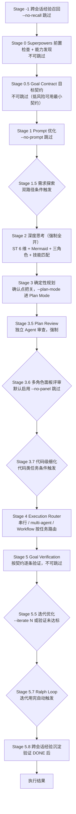

# flow-deep — 全量深度任务编排引擎

一句话定位：`/flow` 的深度版本，默认启用全部质量保障阶段，适用于复杂、重要、高风险任务 (SKILL.md:L31)。

> SKILL.md 为单一事实来源，本 README 为人向导览快照（生成于 2026-09-09）。OVERVIEW.md 是 SKILL.md 的深度展开附件。

## 是什么，解决什么问题

AI Agent 能力强但缺纪律。flow-deep 面向「做错了很难恢复」的任务——核心重构、支付、认证、对外接口、安全——把 flow 中「参数可选」的纪律升级为「默认强制」：

| 强制项 | 内容 | 出处 |
|--------|------|------|
| Stage 0 前置检查 | superpowers 依赖逐项硬检查 + 能力发现（扫描已装 skills 与 capability-registry 交叉比对） | (SKILL.md:L202-221) |
| Stage 2 深度思考全开 | Sequential Thinking 6 维 + Mermaid + 三角色讨论 + 技能匹配 | (SKILL.md:L297-318) |
| Stage 3 规划确认点 | plan 落盘 + 质量自检 + 用户确认，默认无弹窗；`--plan-mode` 才进 Plan Mode | (SKILL.md:L349) |
| Stage 3.5 Plan Review | 独立 Agent 以 Staff Engineer 视角 6+3 维审查，强制启用 | (SKILL.md:L388-390, L400-402) |
| Stage 3.6 面板评审 | 多角色并行评审 + Auto-Decide Layer 自动消化常规发现 | (SKILL.md:L413-419) |
| Stage 4 TDD 注入 | 代码实现 Agent 注入 RED-GREEN-REFACTOR 工作流 | (SKILL.md:L497, L510) |
| Stage 5 Goal Verification | 按目标契约逐条验证并输出证据表，不可跳过 | (SKILL.md:L560-573, L586) |

「强制」不等于「接管流程」。设计宪法（Design Constitution）用四问自检——必要性 / 可拆性 / 可跳过性 / 控制权——防止重型引擎持续膨胀、剥夺用户控制；任何「强制不可跳过」的 Stage 必须写清 why，用户始终握有 `--no-xxx` 逃生阀 (SKILL.md:L35-48)。详见 [SKILL.md 设计宪法](SKILL.md#设计宪法design-constitution)。

与 /flow 的核心差异速览 (SKILL.md:L146-154)：

| 差异点 | flow | flow-deep |
|--------|------|-----------|
| Stage 0 前置检查 | 无 | 强制，不可跳过 |
| Stage 2 深度思考 | `--think` 等可选 | 强制全开 |
| 规划审批 | `--strict-plan` 默认进 Plan Mode（弹窗），可 `--no-strict-plan` 禁用 | 默认对话内确认（无弹窗），`--plan-mode` 才进 Plan Mode |
| Plan Review | `--plan-review` 可选 | 强制 |
| 面板评审 | 无 | 默认启用（`--no-panel` 跳过） |
| 完成验证 | `--no-verify` 可跳 | 不可跳过 |
| `--quick` 预设 | 有 | 无 |
| STATE.md 跨会话恢复 | 无 | 有 |

两引擎全 Stage 并排对比见 [OVERVIEW.md 管道流程对比](OVERVIEW.md#管道流程对比)。

## 触发方式

显式命令格式 (SKILL.md:L686)：

```
/flow-deep [options] <任务表述>
```

自然语言触发信号 (SKILL.md:L111-115)：

| 触发信号 | 示例 |
|---------|------|
| 显式调用 | `/flow-deep 重构认证系统` |
| 深度编排请求 | "深度分析这个任务"、"用全量管道处理" |
| 关键词 | flow-deep、深度编排、全量管道、复杂任务深度分析 |
| 风险标注 | 任务明确标注为复杂 / 重要 / 高风险 |

负向边界：简单任务、快速原型、单步操作不要使用，改用 /flow (SKILL.md:L7)。入口之后还有复杂度闸门二次确认：单文件、低风险、可逆改动会被提示降级为 `/flow` 或轻量串行处理 (SKILL.md:L181-183)。

参数速查摘要（完整参数表见 [SKILL.md 参数速查](SKILL.md#参数速查)）：

| 类别 | 常用参数 | 说明 |
|------|---------|------|
| 阶段开关 | `--no-prompt` `--no-plan` `--plan-mode` `--no-multi` `--no-recall` `--no-context-guard` | 各 Stage 逃生阀 / `--plan-mode` 进 Plan Mode / 禁用容量检测弹窗 (SKILL.md:L688) |
| 思考 | `--think-hard` `--no-think` `--no-mermaid` `--no-discuss` `--no-skill-match` | 升级 10K 或关闭各思考件 (SKILL.md:L689) |
| 执行 | `--no-tdd` `--tdd-dual` `--no-review` `--no-panel` `--panel-roles` `--panel-depth` `--no-prime` | TDD / 审查 / 面板 / prime-agent 路由控制 (SKILL.md:L690) |
| 迭代 | `--iterate N` `--guard <cmd>` `--ralph-max N` `--no-ralph` `--no-distill` | 迭代与经验沉淀控制 (SKILL.md:L691) |
| 配置 | `--plan-dir <dir>` `--agents <types>` `--lang <zh|en>` `--dry-run` | 规划目录 / Agent 类型 / 输出语言 / 仅出计划 (SKILL.md:L692-693) |

## 核心架构

一句话：在 flow 的「优化 → 思考 → 规划 → 执行 → 验证 → 迭代」骨架两端各加一层——入口端强制「经验召回 + 能力盘点 + 目标契约」，出口端强制「按契约验证 + 经验沉淀」，形成跨会话闭环。



深度内容不在 README 复制（避免制造双事实源），直达原文：

| 想了解 | 直达 |
|--------|------|
| flow vs flow-deep 全 Stage 对比 | [OVERVIEW.md 管道流程对比](OVERVIEW.md#管道流程对比) |
| 完整依赖矩阵（必需 / MCP / superpowers / 迭代增强） | [OVERVIEW.md 依赖清单](OVERVIEW.md#依赖清单) 或 [SKILL.md 必需依赖](SKILL.md#必需依赖) |
| 4 条 Iron Laws 铁律 + Rationalization Table | [OVERVIEW.md 铁律体系](OVERVIEW.md#iron-laws-铁律体系) |
| 面板评审 Auto-Decide Layer 六原则 | [OVERVIEW.md Auto-Decide Layer](OVERVIEW.md#auto-decide-layer面板评审) |
| auto-iterate 与 Ralph Loop 的分工对比 | [OVERVIEW.md 对比](OVERVIEW.md#auto-iterate-vs-ralph-loop-的关系) |
| 设计哲学（GStack / Superpowers / GSD 三框架分工） | [OVERVIEW.md 设计哲学](OVERVIEW.md#设计哲学) |
| 各 Stage 完整行为 | [SKILL.md 执行流程](SKILL.md#执行流程) |
| 上下文管理 + STATE.md 模板 | [references/context-management.md](references/context-management.md) |
| Goal Contract 模板 | [references/goal-contract.md](references/goal-contract.md) |
| 能力发现注册表 | [references/capability-registry.md](references/capability-registry.md) |
| 多仓任务工具链 | [references/multi-repo-toolchain.md](references/multi-repo-toolchain.md) |

几个值得点名、细节看原文的机制：

- **Goal Contract（Stage 0.5）**：执行前先立契约——Objective / Success Criteria / Constraints / Non-goals / Verification Plan / Execution Strategy (SKILL.md:L250-256)；Stage 5 逐条对照输出证据表，防止「高效执行但偏离目标」(SKILL.md:L568-573)
- **STATE.md 活记忆**：小于 80 行的 `.plan/STATE.md` 记录 current_stage 与 next_action，会话中断后可恢复到指定 Stage (SKILL.md:L174, L185-189)
- **Context Guard**：脚本实测上下文占用百分比（模型无法自感占用），超过 70% 弹窗三选（继续 / 生成 HANDOFF.md 交接 / 跳过），超过 85% 建议 /compact (SKILL.md:L160-172)
- **Execution Router**：Stage 4 不固定等于 /multi-agent，按任务形态在「当前会话串行 / /multi-agent / Workflow」间路由，选 Workflow 前必须过 Fit Gate 并说明理由 (SKILL.md:L469-487)
- **跨会话经验闭环**：Stage -1 启动时强制召回任务相关历史经验 (SKILL.md:L223-227)；Stage 5.8 验证通过后把可复用经验沉淀回 auto-skill 知识库 (SKILL.md:L627-632)

## 最小使用示例

示例 1 —— 高风险重构走全量管道 (SKILL.md:L664-672)：

```
/flow-deep 重构认证系统

→ Stage 0: Superpowers 前置检查
→ Stage 0.5: Goal Contract（目标、成功标准、约束、验证计划）
→ Stage 1: Prompt 优化 → Stage 2: 深度思考 + 技能匹配(TDD+并行+审查)
→ Stage 3: 规划+确认点 → Stage 3.5: Plan Review → Stage 3.6: 多角色面板评审
→ Stage 4: Execution Router 选择 multi-agent（auth-core[TDD] + token-mgr[TDD]）
→ Stage 5: Goal Verification（逐条核对 Success Criteria）
```

示例 2 —— 多维审查任务命中 Workflow 路由 (SKILL.md:L675-681)：

```
/flow-deep 全面审查这个仓库的性能、安全和架构问题

→ Stage 0.5: Goal Contract 明确审查范围和成功标准
→ Stage 4: Execution Router 命中 Workflow Fit Gate
→ Workflow: Review Workflow（性能 / 安全 / 架构 fan-out → 去重 → 验证 → 综合）
→ Stage 5: Goal Verification 输出审查覆盖和证据表
```

## 与其他 skill 的关系

选型口诀：**小澄清 grill-me，大工程 flow-deep，中间 flow**；拿不准问「做错了多难恢复」——难恢复就 flow-deep (SKILL.md:L121)。

| 场景 | 入口 |
|------|------|
| 核心重构 / 支付 / 认证 / 对外 / 安全 | flow-deep（本 skill） |
| 中等特性（3-5 步、可回滚） | [flow](../flow/README.md) |
| 只想澄清、产出 design tree | grill-me |
| 方向都没定 | 自由对话 / brainstorming (SKILL.md:L123-128) |

- **双引擎定位速记**：flow「按需启用」、flow-deep「默认全开」(OVERVIEW.md:L9-10)
- **与 [flow](../flow/README.md) 的资源共享**：需求探索协议、Agent 分发、清理脚本、Stage 5 验证、Stage 5.5 迭代协议复用 flow 侧 references 共享文件 (SKILL.md:L289, L502, L531, L564, L593)；反向地，flow 的 `--code-plan` 依赖本 skill 的 `references/code-planning.md`，建议双引擎同装
- 完整决策依据、组合用法、三种误用：[flow 侧 selection-guide.md](../flow/references/selection-guide.md) (SKILL.md:L119)
- 开源发布副本（产品级 README + 本 skill 的对外发布版本）：<https://github.com/FrizzleFur/flowkit>
