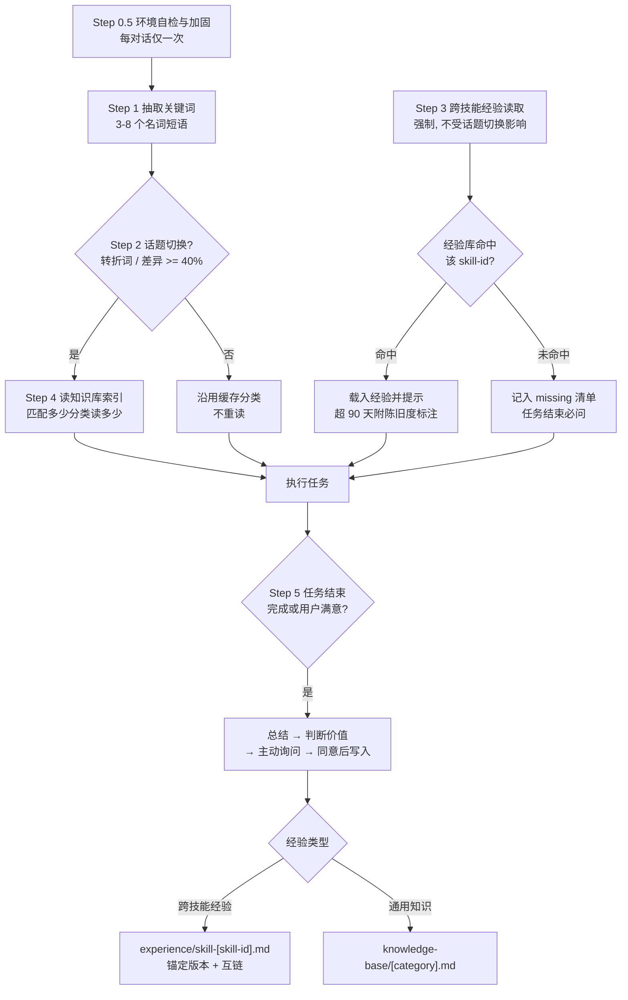

# auto-skill

> 自进化知识系统：所有任务的底层依赖协议，维护「通用知识 + 跨技能经验」双库，形成跨会话记忆闭环。

> SKILL.md 为单一事实来源，本 README 为人向导览快照（生成于 2026-09-08）。

## 一、是什么 / 解决什么问题

LLM 的会话记忆是沙漏型的：会话内上下文丰富，会话结束即清零。同一个坑——某个工具的版本兼容问题、某类任务的参数顺序、某个平台的渲染限制——这次花二十分钟定位，下次换个会话重头再来。所有调试成果都随会话一起蒸发。

auto-skill 解决的就是「每次对话从零开始重复踩坑」的问题。它在两个时点介入：

- **任务结束**：主动询问是否把本次解法沉淀入库，把一次性踩坑成本转化为可复利资产；
- **任务开始 / 进行中**：自动匹配并召回相关知识与经验，在回复中提示「我已读取经验：skill-xxx.md」。

它在用户环境中的地位是**元技能**：不是做某类具体工作的技能，而是所有任务与其他技能的底层依赖（SKILL.md:L3）。本机全局规则文件 `~/.claude/CLAUDE.md` 中的「任务启动协议（强制）」即要求：开启新任务或触发任何技能时，必须先读取并执行 auto-skill 的 SKILL.md。

## 二、触发方式：全局强制协议，而非触发词路由

绝大多数 skill 按 description 关键词匹配路由——用户说到相关话题才触发。auto-skill 是设计上的例外：它的 description 是全局协议文案（"CRITICAL PROTOCOL…… 适用于所有任务"，SKILL.md:L3），无负向边界是特性而非疏漏——全适用正是协议的目的。

全局生效通过两条路径保证：

1. **自举加固（Step 0.5）**：每个对话首次触发时，检测全局规则文件（如 `~/.claude/CLAUDE.md`）是否已包含「任务启动协议」；若未包含则自动追加，使协议永久生效（SKILL.md:L16-L36）。本机 CLAUDE.md 中该协议即由此固化而来。
2. **任务启动协议**：任何新任务 / 技能触发前，先读取并执行 auto-skill 的 SKILL.md。

协议核心是每轮对话必须遵循的循环（SKILL.md:L12-L14）：

| 步骤 | 名称 | 做什么 | 读取时机 |
|---|---|---|---|
| 0.5 | 环境自检与加固 | 检测并补写全局规则中的任务启动协议 | 每对话仅一次（SKILL.md:L17） |
| 0 | 对话内缓存 | 维护关键词、话题指纹、已读分类/技能等 7 项缓存，避免重复读档（SKILL.md:L38-L46） | 每轮更新 |
| 1 | 抽取关键词 | 从用户消息抽取 3-8 个核心名词，生成话题指纹（SKILL.md:L48-L50） | 每回合 |
| 2 | 话题切换判定 | 转折词 / 关键词差异 >= 40% / 用户新增分类需求（SKILL.md:L52-L56） | 每回合 |
| 3 | 跨技能经验读取 | 用到任何非 auto-skill 技能时，读经验库并提示；强制执行，不受话题切换影响（SKILL.md:L58） | 用到即读，同对话不重读 |
| 4 | 知识库匹配 | 仅话题切换时读知识库索引，按关键词匹配分类，匹配多少读多少（SKILL.md:L69-L79） | 仅话题切换 |
| 5 | 任务结束主动记录 | 总结经验、判断价值、主动询问、用户同意后写入双库（SKILL.md:L81-L95） | 任务完成或用户满意时 |

## 三、核心架构

### 核心循环



```
 [Step 0.5 自举加固]      [Step 3 经验读取(强制)]      [Step 5 主动记录]
        |                        |                            |
        v                        v                            v
 [Step 1 抽关键词] --> [Step 2 话题切换?] --是--> [Step 4 知识库匹配]
                               |                      |
                              否(沿用缓存)            v
                               +----------------> [执行任务] --> [结束询问]
```

### 双库机制

| 维度 | knowledge-base（通用知识库） | experience（跨技能经验库） |
|---|---|---|
| 定位 | 跨领域通用知识 | 按 skill-id 组织的实战经验 |
| 存储单元 | `[category].md` 分类文件 | `skill-[skill-id].md` 每技能一档 |
| 典型内容 | 可重用流程、决策步骤、用户偏好、模板清单（SKILL.md:L111-L118） | 踩坑与解法、关键参数、可套用模板、资产路径（SKILL.md:L127-L132） |
| 索引条目字段 | name / keywords / lastUpdated / description | skillId / file / keywords / lastUpdated / subject_version / description |
| 读取时机 | 仅话题切换时（Step 4） | 用到非 auto-skill 技能即强制读（Step 3） |
| 索引文件 | `knowledge-base/_index.json` | `experience/_index.json` |

两库共享同一个判断核心：**「这东西下次能让用户省时间吗？」**（SKILL.md:L107）。一问一答、纯概念解释、不可复用的一次性结论不入库。

### 条目格式要点

- **证据链字段**：experience 条目包含 Trigger（什么场景触发）、Observation（观察到的事实）、Outcome（方案效果验证），目的是让经验记录从「结论」变为「证据链」，方便判断是否适用于新场景（SKILL.md:L160-L166, L172-L176）。
- **版本锚定**：索引条目记录 `subject_version`（经验针对的对象版本，如 "prime-agent v0.8.1"），与 `lastUpdated` 共同支撑召回时的陈旧度判断（SKILL.md:L93, L143）。
- **陈旧度标注（过期不静默）**：命中条目距今超过 90 天或版本明显不符时，提示行必须附标注，如「我已读取经验：skill-xxx.md（2026-07 记录，针对 v0.7.2，注意时效）」（SKILL.md:L66）。
- **交叉授粉**：沉淀时可记录 `consumed_by`（本经验可服务的任务类型）并用 `[[条目名]]` 与相关条目互链，召回时顺带提示同族条目（SKILL.md:L94）。
- **动态分类**：问题不属于现有分类时，与用户协商新建分类文件并更新索引（SKILL.md:L189-L194）。
- **QMD 升级（预留）**：知识库超过 50 条时建议接入 QMD 做语义检索（SKILL.md:L198-L204）。

### 目录结构

```
auto-skill/
├── SKILL.md              # 协议本体（单一事实来源）
├── README.md             # 本文档
├── knowledge-base/       # 运行时数据：分类文件 + _index.json（持续增长）
├── experience/           # 运行时数据：skill-[skill-id].md 经验档 + _index.json
├── references/           # 协议参考文档
└── scripts/              # check_integrity.py：悬空路径与 [[wikilink]] 完整性检查（只报告不修复）
```

两个 `_index.json` 均为「条目数组 + lastUpdated + version + description」结构，条目通过 keywords 字段供关键词匹配；具体条目内容随使用持续演化，机制以上述格式为准。

## 四、最小使用示例

一次典型的跨会话闭环：

**第一次会话（沉淀）**

1. 用户借助某渲染技能完成视频导出任务；
2. 协议检测到本回合使用了非 auto-skill 技能，查 `experience/_index.json` 未命中 → 记入 missing 清单（SKILL.md:L67）；
3. 任务完成触发 Step 5「缺少经验时必问」：主动询问「这次使用了该技能，但经验库没有记录。我可以把这次的做法记录下来吗？」（SKILL.md:L97-L101）；
4. 用户同意 → 写入 `experience/skill-[skill-id].md`（含 Trigger / Observation / Outcome），更新索引并锚定 subject_version。

**第二次会话（召回）**

1. 数周后用户再次使用同一技能；
2. Step 3 命中经验档 → 载入并提示「我已读取经验：skill-xxx.md」（SKILL.md:L65）；
3. 若条目已超 90 天或版本不符 → 提示行自动附陈旧度标注，提醒注意时效；
4. 本次发现的新技巧，任务结束时增量补写进同一经验档。

旧坑不重踩，新坑持续沉淀——这就是闭环的全部含义。

## 五、与其他 skill 的关系

- **flow / flow-deep**：auto-skill 是其经验底座。flow-deep 管道中的 Stage -1（跨会话经验召回）与 Stage 5.8（跨会话经验沉淀）直接建立在 auto-skill 双库之上，构成「召回 → 执行 → 验证 → 沉淀」的完整闭环；详见 [../flow-deep/README.md](../flow-deep/README.md)。
- **关联技能**：frontmatter 声明 related_skills 为 self-evolution 与 historical-session-analysis（SKILL.md:L5-L7）。
- **开源发布副本**：协议与骨架见 [FrizzleFur/flowkit](https://github.com/FrizzleFur/flowkit)——个人数据本地维护，开源仓库只含协议与目录骨架，不含任何知识库 / 经验库内容。
