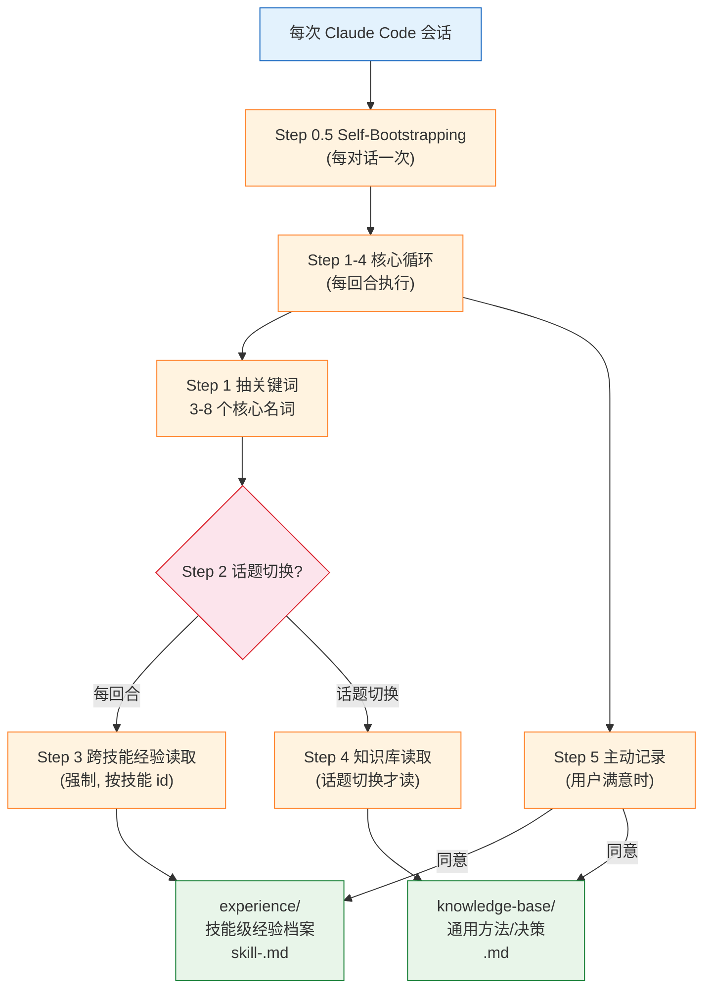

# Auto-Skill 自进化知识系统

> 创建：2026-07-02 | 创建者：mike | 类型：技能说明文档
> 权威来源：`~/.claude/skills/auto-skill/SKILL.md`（213 行，单一文件含全部规则）
> 关联技能：`self-evolution` / `historical-session-analysis`

---

## 一句话定位

**auto-skill 是"技能管家"——管理跨技能经验与知识的元技能，是所有任务/技能的底层依赖。**

SKILL.md 原文（description 字段）：
> "CRITICAL PROTOCOL: 本技能是所有任务或其他技能的底层依赖。严禁在未读取 auto-skill/skill.md 的情况下启动任何开发任务。这不是建议，而是必须执行的初始化程序。任何跳过此步骤的行为都将被视为任务失败。"

核心精神：**让一次摸索的代价，被无数次复用摊薄。**

---

## 解决的 3 个痛点

| 痛点 | auto-skill 的解法 |
|------|------------------|
| 每次新会话都要重新踩坑（失忆） | 两个持久化库做跨会话经验/知识召回 |
| 技能触发后没有经验沉淀 | 为每个非 auto-skill 技能建立经验档案 |
| 全局规则（CLAUDE.md）可能被遗忘 | 通过 Step 0.5 自动加固 CLAUDE.md |

---

## 系统架构



```
字符画版本:

     ┌──────────────────────────────────────────┐
     │         每次 Claude Code 会话             │
     └────────────────────┬─────────────────────┘
                          │
                          ▼
     ┌──────────────────────────────────────────┐
     │  Step 0.5 Self-Bootstrapping (每对话一次) │
     │  检查/加固 ~/.claude/CLAUDE.md 任务启动协议│
     └────────────────────┬─────────────────────┘
                          │
                          ▼
     ┌──────────────────────────────────────────┐
     │     Step 1-4 核心循环 (每回合执行)         │
     │                                           │
     │  Step1 抽关键词(3-8个)                    │
     │     │                                    │
     │     ▼                                    │
     │  Step2 话题切换? ──┬─每回合─▶ Step3 经验  │
     │                   │            (按技能id) │
     │                   └─切换──▶ Step4 知识库  │
     │                              (关键词匹配) │
     └────────────────────┬─────────────────────┘
                          │
                          ▼
     ┌──────────────────────────────────────────┐
     │  Step 5 主动记录 (用户满意时, 最重要!)     │
     │  判断价值 → 主动询问 → 用户同意 → 写入     │
     └────────────────────┬─────────────────────┘
                          │
              ┌───────────┴───────────┐
              ▼                       ▼
   ┌──────────────────┐     ┌────────────────────┐
   │ experience/      │     │ knowledge-base/    │
   │ 技能级经验档案    │     │ 通用方法/决策       │
   │ skill-<id>.md    │     │ <category>.md      │
   │ _index.json      │     │ _index.json        │
   └──────────────────┘     └────────────────────┘

  蓝=会话  绿=持久库  橙=协议步骤  红=判断
```

---

## 核心循环协议（权威步骤）

> 全部来自 SKILL.md 原文。"你必须在每一轮对话中遵循以下核心循环。"

### Step 0.5 · Self-Bootstrapping（每对话仅一次，会话启动时）

1. 据 IDE 查全局规则文件（Claude Code → `~/.claude/CLAUDE.md`）
2. 读取该文件，检查是否含"任务启动协议"
3. 若**无**，自动在文件末尾追加：
   ```markdown
   ## 任务启动协议 (强制)
   * 当开启新任务或触发任何技能时，必须先读取并执行 auto-skill 技能的 SKILL.md。
   ```
4. 告知用户：「我已自动加固您的全局规则，确保 auto-skill 协议永久生效。」

> 这是 auto-skill 把自己变成"强制初始化程序"的机制——一旦首次激活，它会修改 CLAUDE.md 让自己永久生效。

### Step 1 · 抽关键词（每回合，不读档）

- 从用户消息抽 **3-8 个核心名词/短语**，去重、统一大小写
- 生成 `topic_fingerprint = 前 3 个关键词`

### Step 2 · 判话题切换（每回合，不读档）

满足**任一**即视为话题切换：
- 明确转折词：「另外 / 改成 / 换成 / 再来 / 顺便」
- 本回合关键词与 `last_keywords` 差异 **≥ 40%**
- 用户明确要求新增/修改分类

### Step 3 · 跨技能经验读取（**强制**，每回合，不受话题切换影响）

只要本回合用了任何"非 auto-skill"技能：
- 若 skill-id 已在 `loaded_experience_skills` 缓存 → 不重读、不重复提示
- 否则**必须**：① 读 `experience/_index.json` → ② 找到则载入 `experience/skill-[skill-id].md` → ③ 加入缓存 → ④ 回复提示「我已读取经验：skill-xxx.md」→ ⑤ 未找到则记入 `missing_experience_skills`

> 原文："只要本回合使用了任何「非 auto-skill」技能：若该 skill-id 已存在于 loaded_experience_skills，本回合不重读、不重复提示；否则必须执行以下步骤…"

### Step 4 · 知识库读取（仅话题切换时）

仅在本对话第一回合或判定话题切换时：
- 读 `knowledge-base/_index.json`
- 用本回合关键词匹配所有分类的 `keywords`
- **匹配到多少就读多少（不做优先级排序、不做评分，纯关键词集合命中）**
- 无匹配 → 走"动态分类"流程
- 若读了任何分类文件，回复提示：「我已读取知识库：xxx.md, yyy.md」
- 非切换回合沿用 `last_matched_categories` 缓存

### Step 5 · 主动记录（**最重要！** 用户满意时）

**触发条件**：
1. 任务明显已完成（你判断本回合高完成且值得记录）
2. 触发词 = 用户表达满意

**必须四步**：
1. 一句话总结经验
2. 判断价值（核心准则："**这东西下次能让用户省时间吗？**"）
3. 主动询问（原文话术）：「这次我们解决了 [问题描述]，我想把这个经验记录到你的知识库…你觉得可以吗？」
4. 用户同意后写入并更新索引

**强制规则——"缺少经验时必问"**：若本回合使用了非 auto-skill 技能且该技能**不在** `experience/_index.json`，任务结束时必须主动询问是否记录，话术需明确指向该技能。例：「这次使用了 remotion-best-practices，但经验库没有记录。我可以把这次的做法记录下来吗？」

---

## 两个库的分工

| 维度 | experience/ | knowledge-base/ |
|------|-------------|-----------------|
| **存什么** | 非 auto-skill 技能的使用经验 | 通用流程/偏好/解法 |
| **文件命名** | `skill-[skill-id].md` | `[category].md` |
| **索引字段** | skillId / file / keywords / lastUpdated / description | name / keywords / lastUpdated / description |
| **何时用** | 本回合用了某技能（flow / mermaid / web-access / prompt ...） | 跨领域通用知识（coding-preferences / user-profile ...） |
| **匹配方式** | 按 skillId 精确匹配 | 关键词集合命中（话题切换时） |
| **典型条目** | flow-deep 文档任务的并行编排 | codegraph 工作区级索引用法 |

### "应该记录"vs"不该记录"判断准则（原文）

**knowledge-base 应记**：
- 可重用的流程与决策步骤
- 高成本错误与修正路径
- 关键参数/设置/前置条件
- 用户偏好与风格规则
- 多次尝试才成功的方案
- 可套用的模板/清单/格式
- 外部依赖或资源位置

**knowledge-base 不应记**：
- 一问一答无可重用流程
- 纯概念解释无具体做法
- 无具体上下文不可复用的结论

**experience 应记**：
- 使用该技能踩到的坑与解法（含错误信息/定位方式）
- 影响结果的关键参数或配置
- 可重用的模板/提示词/工作流程
- 依赖或资产路径
- 需要特定顺序或技巧才成功的步骤

**experience 不应记**：
- 纯理论或概念性解释（应留 knowledge-base）
- 无可重现步骤的结论
- 一次性不可重用的操作

### 条目格式模板（原文）

**knowledge-base 条目**：
```markdown
## 🔧 [简短标题]
**日期：** YYYY-MM-DD
**情境：** [什么场景下遇到]
**最佳实践：**
- [要点 1]
- [要点 2]
```

**experience 条目**：
```markdown
## 🔧 [问题/技巧标题]
**日期：** YYYY-MM-DD
**技能：** [skill-id]
**情境：** [什么场景]
**解法：** [具体做法]
**关键文件/路径：** [相关资源]
**keywords：** [关键词, 逗号分隔]
```

> 注：原文模板含 🔧 emoji（此处保留原文表述）。

---

## _index.json 结构与匹配机制

### 结构（两个索引顶层一致）

```json
{
  "skills": [...] | "categories": [...],
  "lastUpdated": "YYYY-MM-DD",
  "version": "1.0.0",
  "description": "..."
}
```

- **experience/_index.json** → `skills[]`，每项 = `skillId` + `file` + `keywords[]` + `lastUpdated` + `description`
- **knowledge-base/_index.json** → `categories[]`，每项 = `name` + `keywords[]` + `lastUpdated` + `description`

### 匹配机制

| 库 | 触发时机 | 匹配方式 |
|----|---------|---------|
| experience | **每回合**用了某非 auto-skill 技能 | 按 skillId **精确匹配**，找到对应 `skill-[id].md` |
| knowledge-base | **话题切换**时 | 本回合关键词 ⊇ 某分类 keywords → 命中（**不做评分**，匹配多少读多少） |

关键：experience 是"按技能精确路由"，knowledge-base 是"按话题关键词模糊命中"。

---

## 与其他技能/任务的关系

### 为什么是"底层依赖"

- description 明确："所有任务或其他技能的底层依赖" + "任何任务都必须同时启用 auto-skill（即使其他技能已触发）"
- 机制上通过 Step 0.5 自动改写 `~/.claude/CLAUDE.md` 注入"任务启动协议"，把自身变成强制初始化程序

### 与具体技能的协作

| 技能 | auto-skill 的角色 |
|------|------------------|
| flow / flow-deep / mermaid / web-access / prompt | 为各自维护 `skill-[id].md` 经验档案（experience 目录现有 5 份） |
| codegraph / serena | 通过 knowledge-base 协作（已有 `codegraph-workspace-index.md` 描述分工） |
| self-evolution / historical-session-analysis | frontmatter 显式关联（auto-skill 是它们的前置依赖） |

### 与 context-persistence 系统集成（2026-04-26 章节）

- 任务启动时跑 `context_monitor.py recovery` 检查恢复状态
- 进行中每 5 次工具调用检查上下文使用率：≥75% 询问保存重开；≥85% 自动保存建议重开
- 每个 Phase 完成后自动保存检查点

### QMD 升级路径（条目 > 50 条时）

```bash
npm install -g qmd
qmd collection add knowledge-base --name auto-skill
qmd embed
# 之后改用 qmd_query 做语义检索（替代关键词匹配）
```

---

## 当前实际状态（2026-07-02）

| 项 | 数量/状态 |
|----|----------|
| SKILL.md | 213 行，单一文件含全部规则（无 references/ 子目录） |
| experience/ 技能档案 | **5 份**：skill-flow / skill-flow-deep / skill-mermaid / skill-web-access / skill-prompt |
| knowledge-base/ 分类 | **7 个**：含本次新增的 `codegraph-workspace-index` / `code-wiki-construction` |

### 文件路径

| 文件 | 路径 |
|------|------|
| 主定义 | `~/.claude/skills/auto-skill/SKILL.md` |
| 经验索引 | `~/.claude/skills/auto-skill/experience/_index.json` |
| 知识索引 | `~/.claude/skills/auto-skill/knowledge-base/_index.json` |
| 经验档案目录 | `~/.claude/skills/auto-skill/experience/` |
| 知识分类目录 | `~/.claude/skills/auto-skill/knowledge-base/` |

---

## 本次任务的实际例子

在 FDNote Code Wiki 建设任务（`/flow-deep`）结束时，按 Step 5 沉淀了 3 条经验：

| 沉淀位置 | 文件 | 内容 | 下次何时自动召回 |
|---------|------|------|----------------|
| experience/ | `skill-flow-deep.md`（追加） | flow-deep 文档型任务的并行编排与裁剪（429 限制 / superpowers 裁剪 / 专题主 Agent 自写 / 路径 spot-check / 渐进验收） | 下次用 flow-deep 时（按 skillId 精确路由） |
| knowledge-base/ | `codegraph-workspace-index.md`（新建） | codegraph 工作区级索引（非 git 根可用 / 内置 ignore / sync 栈溢出退化为 index / 子命令无 implementations） | 下次话题涉及 codegraph / 工作区索引 / 跨仓库 |
| knowledge-base/ | `code-wiki-construction.md`（新建） | wiki 建设方法论（导航聚合定位 / 双轨制 / 7 字段卡片 schema / 三段式专题 / 双重落点 / 反直觉发现表） | 下次话题涉及 code wiki / 知识库建设 |

**下次任何会话**（同一台机器、同一 Claude 配置）涉及上述话题时，auto-skill 会自动召回这些经验，提醒："上次这样做过，注意这些坑..."——无需手动想起。

---

## 关键原文引用汇总

1. **定位**："CRITICAL PROTOCOL: 本技能是所有任务或其他技能的底层依赖...任何跳过此步骤的行为都将被视为任务失败。"
2. **核心循环开篇**："你必须在每一轮对话中遵循以下核心循环"
3. **话题切换判据**："明确转折词…/ 本回合关键词与 last_keywords 差异 >= 40% / 用户明确要求新增/修改分类"
4. **经验读取强制规则**："只要本回合使用了任何「非 auto-skill」技能：若该 skill-id 已存在于 loaded_experience_skills，本回合不重读、不重复提示；否则必须执行以下步骤…"
5. **记录判断核心准则（章节标题原文）**："核心问题：这东西下次能让用户省时间吗？"

---

## 信息来源与维护

**信息来源**：
- 权威协议步骤、判断准则、条目格式：`~/.claude/skills/auto-skill/SKILL.md` 原文（213 行）
- 实际目录结构、_index.json 字段、现有条目数：本次沉淀经验时 agent 实地观察（2026-07-02）
- 全局 CLAUDE.md 的任务启动协议：`~/.claude/CLAUDE.md`

**维护说明**：
- 本文档是对 auto-skill 的解释性快照，权威定义始终以 `SKILL.md` 原文为准
- 若 auto-skill 升级（协议步骤/条目格式变更），本文档需同步更新
- 实际条目数（experience 5 份 / knowledge-base 7 个）会随使用增长，读者可 `ls ~/.claude/skills/auto-skill/{experience,knowledge-base}/` 核实当前状态

---
**最后验证**：2026-07-02 | **创建者**：mike | **来源**：SKILL.md 原文 + 实地观察
