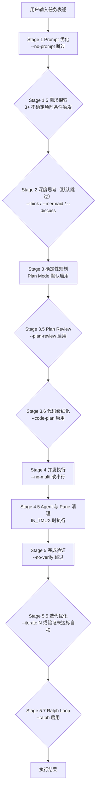

# flow — 轻量任务编排引擎

一句话定位：将复杂任务拆为「Prompt 优化 → 深度思考 → 规划 → 并发执行」的完整管道，通过参数灵活控制每个阶段 (SKILL.md:L31)。

> SKILL.md 为单一事实来源，本 README 为人向导览快照（生成于 2026-09-08）。

## 是什么，解决什么问题

AI Agent 的单点能力已经足够强，长任务执行中真正稀缺的是纪律性。flow 用「分阶段管道 + 检查点 + 回退协议」把纪律做进流程，针对五类典型失控行为逐一设防：

| 典型失控行为 | flow 的约束机制 |
|-------------|----------------|
| 边想边改，没设计就动手 | Stage 3 默认进入 Plan Mode 只读沙箱，plan 经用户审批后才执行 (SKILL.md:L287, L294-299) |
| 模糊需求直接开干 | Stage 1 先评分优化任务表述 (SKILL.md:L237-240)；存在 3+ 不确定项时 Stage 1.5 主动追问 (SKILL.md:L246) |
| 沉没成本偏差，方案没人复核 | Stage 3.5 用独立 Agent 以 Staff Engineer 视角六维审查 plan (SKILL.md:L342-348) |
| 宣布完成却没有证据 | Stage 5 铁律：No completion claims without fresh verification evidence，禁止 should work / probably (SKILL.md:L420) |
| 执行遇意外就地硬修 | 退回 Plan 协议：先问「plan 哪里假设错了」，同一 Phase 两次 Fallback 退回 Stage 2 (SKILL.md:L400-404) |

flow 系是「双引擎」架构，按风险等级分工：

| 引擎 | 定位 | 默认策略 | 适用场景 |
|------|------|---------|---------|
| `/flow`（本 skill） | 轻量编排引擎 | 按需启用——能力靠参数打开 | 中等特性：3-5 步、单模块、可回滚 (SKILL.md:L54) |
| `/flow-deep` | 全量深度引擎 | 默认全开——质量机制强制启用 | 核心重构 / 支付 / 认证 / 对外 / 安全 (SKILL.md:L55) |

flow 处于梯队中间档：比自由对话多一层管道纪律，比 flow-deep 少一批强制检查点；每个阶段完成后向用户展示简报并确认，失败时不自动跳过 (SKILL.md:L484-485)。

## 触发方式

显式命令格式 (SKILL.md:L184)：

```
/flow [options] <任务表述>
```

自然语言触发信号 (SKILL.md:L35-44)：

| 触发信号 | 示例 |
|---------|------|
| 显式调用 | `/flow 重构支付系统，支持多币种` |
| 复杂任务表述 | "帮我处理这个复杂任务"、"这个任务比较复杂" |
| 编排式表述 | "先优化再规划再执行"、"从优化到执行" |
| 关键词 | flow、编排、管道、复杂任务流程 |
| 自动检测 | 任务涉及 3+ 步骤，或提及多技能组合（如"先 /prompt 再 plan 再 multi-agent"）(SKILL.md:L43-44) |

负向边界：简单单步任务不要使用；深度版用 /flow-deep (SKILL.md:L7)。

参数速查摘要（完整参数表见 [SKILL.md 参数速查](SKILL.md#参数速查)）：

| 类别 | 常用参数 | 说明 |
|------|---------|------|
| 预设（互斥） | `--quick` / `--standard` / `--deep` | 极简跳过 / 默认全流程 / 深度分析并建议 Plan Review (SKILL.md:L206-209) |
| 思考增强 | `--think` `--think-hard` `--mermaid` `--discuss` | Sequential Thinking 4K / 10K / Mermaid 可视化 / 三角色讨论 (SKILL.md:L188-191) |
| Plan 质量 | `--strict-plan`（默认开）`--plan-review` `--precise-plan` | Plan Mode / 独立 Agent 审查 / 精确到文件路径行号 (SKILL.md:L193-197) |
| 执行注入 | `--code-plan` `--tdd` `--review` `--no-multi` | 代码级细化 / TDD 注入 / 代码审查 / 改串行 (SKILL.md:L193-196) |
| 迭代增强 | `--iterate N` `--guard <cmd>` `--ralph` `--ralph-max N` | 迭代优化 / 防回归 / 强制持续 / 轮数上限 (SKILL.md:L200-203) |
| 配置 | `--plan-dir <dir>` `--agents <types>` `--lang <zh|en>` `--dry-run` | 规划目录 / Agent 类型 / 输出语言 / 仅出计划 (SKILL.md:L200-203) |

## 核心架构

一句话：一条「优化 → 思考 → 规划 → 执行 → 验证 → 迭代」的线性管道，每个阶段有明确的启用/跳过参数与产物，异常按协议回退而非硬修。



Stage 一览（默认状态与控制参数）：

| Stage | 名称 | 默认 | 控制参数 | 关键产物 |
|-------|------|------|---------|---------|
| 1 | Prompt 优化 | 启用 | `--no-prompt` | 优化后的任务表述 (SKILL.md:L230-241) |
| 1.5 | 需求探索 | 条件触发 | 3+ 不确定项自动 | 明确后的任务表述 (SKILL.md:L244-254) |
| 2 | 深度思考 | 跳过 | `--think` `--mermaid` `--discuss` | findings.md 思考结论 (SKILL.md:L256-277) |
| 3 | 确定性规划 | 启用 | `--no-plan` | task_plan / findings / progress 三件套 (SKILL.md:L279-335) |
| 3.5 | Plan Review | 跳过 | `--plan-review` | 六维审查报告 (SKILL.md:L337-363) |
| 3.6 | 代码级细化 | 跳过 | `--code-plan` | TDD 步骤级 plan (SKILL.md:L365-373) |
| 4 | 并发执行 | 启用 | `--no-multi`（串行） | Agent 执行结果 (SKILL.md:L375-406) |
| 4.5 | Agent 与 Pane 清理 | 条件执行 | IN_TMUX 时 | pane 回收 (SKILL.md:L408-412) |
| 5 | 完成验证 | 启用 | `--no-verify` | 新鲜验证证据 (SKILL.md:L414-422) |
| 5.5 | 迭代优化 | 条件触发 | `--iterate N` | keep/revert 迭代记录 (SKILL.md:L424-432) |
| 5.7 | Ralph Loop | 跳过 | `--ralph` | Stop Hook 强制持续 (SKILL.md:L434-455) |

必需依赖（缺失则对应阶段不可用）(SKILL.md:L63-67)：

| 依赖 | 类型 | 用于阶段 |
|------|------|---------|
| `/prompt` | Skill | Stage 1: Prompt 优化 |
| `planning-with-files` | Skill | Stage 3: 任务规划 |
| `/multi-agent` | Skill | Stage 4: 并发执行 |

可选依赖：`/mermaid`（`--mermaid` / `--deep`）、Sequential Thinking（MCP 而非 Skill，`--think` 系列启用）、`/flow-deep`（`--code-plan` 需要其 code-planning.md）(SKILL.md:L69-75)。superpowers 技能与迭代增强依赖的完整矩阵见 [SKILL.md 必需依赖](SKILL.md#必需依赖)。

各阶段深度细节不在 README 复制（避免制造双事实源），直达原文：

| 想了解 | 直达 |
|--------|------|
| 各 Stage 完整行为 | [SKILL.md 执行流程](SKILL.md#执行流程) |
| Stage 1.5 追问协议 | [references/needs-exploration.md](references/needs-exploration.md) |
| Stage 2 三种思考模式 | [references/stage2-details.md](references/stage2-details.md) |
| Plan 质量标准 Checklist | [references/plan-quality.md](references/plan-quality.md) |
| Plan Review 协议 | [references/plan-review.md](references/plan-review.md) |
| Agent 分发与 tmux 分屏 | [references/agent-dispatch.md](references/agent-dispatch.md) |
| 退回 Plan 协议 | [references/fallback-protocol.md](references/fallback-protocol.md) |
| 完成验证铁律 | [references/stage5-verification.md](references/stage5-verification.md) |
| 迭代优化协议 | [references/stage55-iteration.md](references/stage55-iteration.md) |
| 更多使用示例 | [references/usage-examples.md](references/usage-examples.md) |

## 最小使用示例

示例 1 —— 标准中型重构，开启深度思考并指定规划目录 (SKILL.md:L221-228)：

```
/flow --think --plan-dir docs/plan 重构支付系统，支持多币种

解析结果:
  任务: 重构支付系统，支持多币种
  启用阶段: prompt优化 → 深度思考 → 规划 → 并发执行
  规划目录: docs/plan/
  思考模式: Sequential Thinking (4K)
```

示例 2 —— 深度分析模式，思考三件套全开 (SKILL.md:L470-471)：

```
/flow --think --mermaid --plan-dir docs/plan 重构支付系统

→ Stage 1 优化 → Stage 2 思考+Mermaid → Stage 3 规划 → Stage 4 并发执行
```

常用变体：`--dry-run` 只执行 Stage 1-3 产出计划、不进入执行 (SKILL.md:L479)；验证未达标时 Stage 5.5 自动迭代（默认 3 轮），`--iterate N` 可显式指定轮数 (SKILL.md:L426)。

## 与其他 skill 的关系

选型口诀：**小澄清 grill-me，大工程 flow-deep，中间 flow**；拿不准时问「做错了多难恢复」(SKILL.md:L50)。

| 场景 | 入口 |
|------|------|
| 只想澄清需求、产出 design tree | grill-me |
| 中等特性（3-5 步、单模块、可回滚） | flow（本 skill） |
| 核心重构 / 支付 / 认证 / 对外 / 安全 | [flow-deep](../flow-deep/README.md) |
| 方向都没定 | 自由对话 / brainstorming (SKILL.md:L52-58) |

- **flow → flow-deep**：`--code-plan` 需读取 [flow-deep](../flow-deep/README.md) 的 `references/code-planning.md`，建议双引擎同装 (SKILL.md:L369)；高风险任务直接改用 `/flow-deep`
- **flow-deep → flow**：flow-deep 的前置复杂度闸门发现单文件、低风险、可逆改动时会提示降级为 `/flow`（详见 [flow-deep README](../flow-deep/README.md)）
- 完整决策依据、升级/降级信号、组合用法、三种误用案例：[references/selection-guide.md](references/selection-guide.md) (SKILL.md:L59)
- 交互式路由可用 `/ask-matt`（路由 mattpocock 体系，不覆盖 flow/flow-deep）(SKILL.md:L59)
- 开源发布副本（产品级 README + 本 skill 的对外发布版本）：<https://github.com/FrizzleFur/flowkit>

## 多平台支持（2026-09-08）

flow 全家（flow / multi-agent / prompt / planning-with-files / auto-iterate / auto-skill）已适配 OpenAI Codex CLI 运行，Claude Code 体验零变化。

### 布设结构：单实体 + symlink 三投

```
~/.claude/skills/flow        ← 权威实体（唯一事实来源，Claude Code 原生路径）
~/.agents/skills/flow   →   symlink（Codex USER 层 skill 目录）
~/.codex/skills/flow    →   symlink（Codex 兼容层）
```

一份实体三处可见，永不漂移；flow 全家 7 个技能（含 flow-deep）均已统一。旧副本备份为 `<name>.bak.20260908`。

### 调用与适配

| 平台 | 调用 | 适配方式 |
|------|------|---------|
| Claude Code | `/flow` | 原生机制，零变化 |
| Codex CLI | `$flow` | 各技能 SKILL.md 文末「平台兼容」小节 → `references/codex-compat.md`（机制映射：AskUserQuestion→编号选项、Plan Mode→plan 呈现+人工切换、Task 系统→.plan 文件协议、Agent→spawn_agent 族） |
| DeepSeek dsh | `/flow` | 机制原生同构（ask_user_question / exit_plan_mode / hooks.json 复用），多数映射不需要；本期仅文档准备，未实测 |

### 设计原则

- **CC 零影响**：frontmatter 与 description 零变更（触发行为不变）；适配内容全部下沉 reference 文件，按渐进披露仅在非 CC 环境加载
- **降级而非砍功能**：Codex 缺 4 个交互原语（结构化问答 / 审批流转 / Task 系统 / 跨会话寻址），全部用平台原语降级模拟，无不可移植项
- **文件协议兜底**：planning-with-files 的 .plan 文件协议是 Task 系统的官方降级载体，这也是它存在于 flow 依赖树的深层原因

### 详细依据

完整调研（三档映射表 / Codex 8 项查证 / dsh 机制对照）见 `FDFeature/toolchain-survey/flow生态移植调研-Codex与DeepSeek.md`（2026-09-08，一手信源）。
