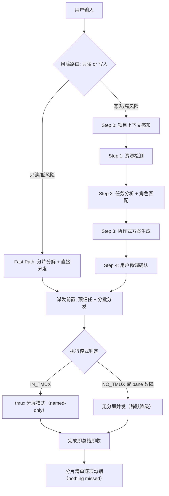

# multi-agent

Agent Teams 方案生成与执行引擎：通过 `Agent(name)` + `SendMessage(to: name)` 工具链并行分发多 agent 团队（subagent 后台运行）；在 tmux 中且 pane 可用时自动获得分屏可视化，无 tmux 或 pane 故障时静默降级为无分屏并发，无需任何前置依赖 (SKILL.md:L4-5)。

> SKILL.md 为单一事实来源，本 README 为人向导览快照（生成于 2026-09-08）。

## 是什么 / 解决什么问题

多 agent 并行最常见的入口是一句话全权委托：用户说 "fan out subagents"、"派团队深挖"，期待的是**立刻派出**，不是先做一轮方案评审 (SKILL.md:L54)。但无纪律的扇出有两个典型失败面：

| 失败面 | 后果 | 本 skill 的对策 |
|--------|------|----------------|
| 分片随意 | agent 范围重叠或遗漏——分片有遗漏，汇总必有遗漏 (SKILL.md:L57) | 分片互斥且完备 + 显式分片清单 + 返回后逐项勾销 (SKILL.md:L57, L64) |
| 并发失控 | 429/1302 限流——实测 6 并发必触发，4 并发加主会话同样触发 (SKILL.md:L154) | 同消息分发默认 ≤3、规模档位、触发后退避恢复 (SKILL.md:L63, L146-150) |

一句话定位：把 "fan out subagents" 从全权委托变成**可控的并行深挖**——只读任务立即分发（Fast Path），写入任务先出完整方案经用户确认再执行（Full Path），两条通道最终都落到「nothing gets missed」的分片覆盖验收 (SKILL.md:L42, L64)。

## 触发方式

| 类别 | 触发词 / 场景 |
|------|---------------|
| 显式命令 | `/MultiAgent <任务描述>` (SKILL.md:L18) |
| 官方 Tip 同款短语 | "fan out subagents"、"fan out"、"sends a team"、"digs deep"、"每个都深挖"、"别漏掉任何东西" (SKILL.md:L21) |
| 中文口语委托 | "多 agent"、"团队协作"、"并行处理"、"teammate"、"创建 agent 团队"、"派团队"、"扇出"、"并行深挖"、"分头调研"、"派几个 agent 分头调研" (SKILL.md:L20, L22) |
| 任务特征 | 请求创建 Agent Teams / spawn teammates；任务需要多 Agent 并发执行 (SKILL.md:L19, L23) |

即使只说一句 "fan out subagents" 也应触发本 skill (SKILL.md:L9)。

### Fast Path vs Full Path：路由判定

分发前先做一次风险判定。判断标准是**任务性质**（只读 vs 写入），不是触发词本身——同一句 "fan out subagents" 对调研任务是 Fast Path，对改代码任务是 Full Path (SKILL.md:L42)。

判定必须有显式锚点：分发前在回复中写出 `路由判定: 只读 → Fast Path`（或 `写入 → Full Path`），未判定就分发属于流程违规 (SKILL.md:L44-45)。

| 通道 | 适用 | 流程 |
|------|------|------|
| Fast Path | 只读/低风险：调研、信息收集、代码审查、文档阅读、多源比对 | 轻量上下文 → 分片分解 → 一行方案预告（告知式，不阻塞）→ 直接分批分发 → 分片清单核对 (SKILL.md:L49) |
| Full Path | 写入/高风险：写代码、改配置、批量文件操作、跨系统重构 | Step 0-5 完整流程：项目上下文感知 → 资源检测 → 任务分析+角色匹配 → 协作式方案 + 用户确认 → 执行 (SKILL.md:L50) |

## 核心架构



ASCII 版本：

```
用户输入
   │
   ▼
风险路由 ──只读/低风险──► Fast Path（分片分解 + 直接分发）──┐
   │                                                       │
   写入/高风险                                              │
   ▼                                                       ▼
Step 0 项目上下文 → Step 1 资源检测 → Step 2 角色匹配    派发前置
→ Step 3 协作式方案 → Step 4 用户微调确认 ──────────────► （预信任 + 分批分发）
                                                            │
                                                            ▼
                                                    执行模式判定
                                                    ├─ IN_TMUX ─► tmux 分屏（named-only）
                                                    └─ NO_TMUX / pane 故障 ─► 无分屏并发
                                                            │
                                                            ▼
                                              完成即总结即收 → 分片清单逐项勾销
```

上图主干（风险分叉 + Step 0-4 + Step 5 执行）取自 SKILL.md:L27-38 原图，派发前置、执行模式分叉与验收落点为按正文小节补全的扩展（各环节锚点见下表）。

### 关键机制

| 机制 | 规则 | 锚点 |
|------|------|------|
| 执行模式判定 | `$TMUX` 检测 → `IN_TMUX → tmux-split` / `NO_TMUX → no-split`；判定行必须显式写出，**跳过检测 ≠ NO_TMUX**，未判定就按降级启动属流程违规 | SKILL.md:L220-227 |
| 规模档位 | small 1-2 / medium 3（默认安全上限）/ large >3（必须分批，每批 ≤3，前批完成 ≥60% 再发下批）；硬约束：同消息 subagent 分发默认 ≤3，存在其他活跃会话时降为 1 或串行 | SKILL.md:L146-158 |
| named-only | tmux 内一律 `Agent(name=...)`——harness 自动分配 pane，且 pane 是独立进程真交互 UI；旧观察窗脚本体系已退役，unnamed 仅保留 NO_TMUX 与纯后台批量场景 | SKILL.md:L260 |
| 预信任 cwd | 派发前必跑 `scripts/pretrust-cwd.sh "$PWD"`（Fast/Full Path 一致），防 trust 弹窗卡 pane；回复中须出现三个合法出口（成功/显式跳过/失败降级）之一 | SKILL.md:L237-250 |
| Delegate 模式 | 主 Agent 是 Coordinator 不是 Implementor：只做任务分配、进度追踪、依赖协调、结果汇总；禁止自己写业务代码、抢占编辑同一文件 | SKILL.md:L319-323 |
| 分片互斥完备 + 勾销验收 | 分片按模块/数据源/风险维度/文件区间互斥且完备；每个 agent 返回后逐项勾销，未覆盖或证据不足 → SendMessage 补查，全部勾销才算完成 | SKILL.md:L57, L64 |
| 完成即总结即收 | 完成通知到达即：主会话总结成果 → `TaskStop(name)` 收本体（pane 自动回收）→ `tmux list-panes` 验证；不得攒批拖延 | SKILL.md:L266-270 |
| Agent 深度要求（digs deep） | 写进每个 fan-out prompt：穷尽分片不抽样、结论带证据锚点（file:line / URL / 数据出处，无锚点标「推测」）、深挖优先于罗列 | SKILL.md:L71-73 |

补充两条编排细节：

- **角色映射动态发现优先**：角色表仅是参考，首选从当前会话可用的 agent types 清单匹配；表中 type 不可用时一律降级 `general-purpose`——引用不存在的 type 会让 Agent 调用直接失败 (SKILL.md:L113)
- **多阶段续接**：Phase 间可复用空闲 agent 省重建开销，但须先过裁决门——确认还有下阶段任务则不收本体、SendMessage 续派复用原 pane；确认不复用则立即 TaskStop (SKILL.md:L330-338)

### 目录结构

| 路径 | 说明 |
|------|------|
| SKILL.md | 单一事实来源（427 行） |
| references/advanced-content.md | 编排理论、通信模式、高级技术、Python 参考代码 (SKILL.md:L427) |
| scripts/pretrust-cwd.sh | 派发前预信任 cwd（当前唯一在主流程引用的脚本）(SKILL.md:L240) |
| scripts/spawn-pane.sh、watch-agent.sh、reap-panes.sh 等 | 旧观察窗体系，已退役，文件留存备查 (SKILL.md:L276) |

## 最小使用示例

### 示例 1: Fast Path——只读调研的一句话委托

```text
输入: fan out subagents 调研支付模块的安全风险

路由判定: 只读 → Fast Path
（轻量上下文：目标目录 src/payment/*；项目规范以必读路径写进 prompt）
预信任完成: 注入 N 跳过 M
分片分发: [输入校验] [鉴权链路] [历史漏洞考古] → 3 agent 单批（并发 ≤3）
（每个 agent prompt 内嵌深度要求三要点：穷尽分片 / 证据锚点 / 深挖优先）

agent 返回 → 分片清单逐项勾销；[鉴权链路] 证据不足 → SendMessage 补查
全部勾销 → 完成（named agent 收尾同样执行「完成即总结即收」）
```

预告行格式、批次数与预信任出口取自 SKILL.md:L60-63；补查与勾销验收取自 SKILL.md:L64。分片内容为场景演示。

### 示例 2: Full Path——写入任务走完整确认

```text
输入: /MultiAgent 实现用户认证功能

Step 0: 读取 CLAUDE.md → 技术栈 Node.js/Express
Step 1: 检测资源 → backend-architect, quality-engineer 在当前会话可用清单中
Step 2: 任务分析 → 功能开发, 中等复杂度

方案草案:
| 队友 | 角色 | subagent_type | 文件范围 | 依赖 |
|------|------|---------------|---------|------|
| api | backend-architect | backend-architect | src/api/auth/*, src/middleware/auth.* | - |
| test | quality-engineer | quality-engineer | tests/auth/* | api |

用户微调 → 确认 → Agent({ name: "api", ... }) + Agent({ name: "test", ... })
```

摘自 SKILL.md:L388-410 的内置示例。

## 与其他 skill 的关系

| 关系 | 说明 |
|------|------|
| 被 flow / flow-deep 调用 | 两者的 Stage 4（并发执行）默认调用本 skill（flow SKILL.md:L67、flow-deep SKILL.md:L60）；flow-deep 的 Execution Router 以「2+ 独立子任务可并行、不需要复杂控制流」为选择条件，并直接沿用本 skill 的规模档位与并发硬约束（flow-deep SKILL.md:L478-489）。导览见 ../flow-deep/README.md |
| auto-skill 经验闭环 | 本 skill 依托 auto-skill 的跨技能经验记忆层沉淀实测教训——SKILL.md 内大量以日期标注的校准条目（如 2026-08-21 跳过检测踩坑、2026-08-24 并发二次校准、2026-09-01 trust 弹窗实测）即该闭环的产出 |
| 开源发布副本 | https://github.com/FrizzleFur/flowkit |
