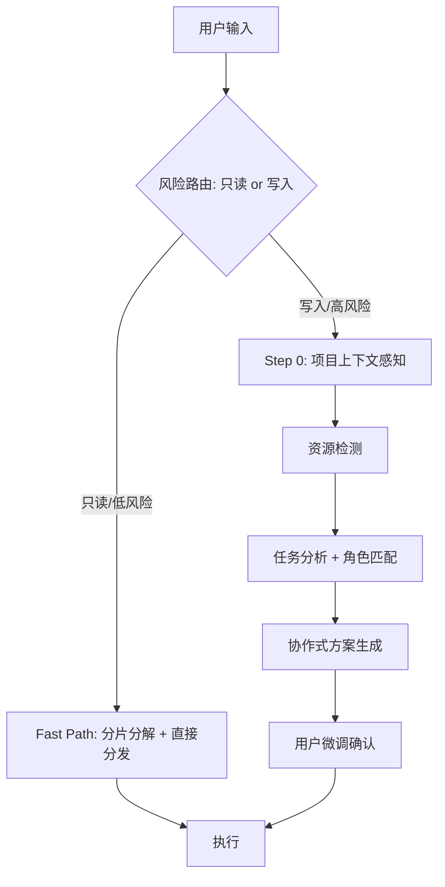

# MultiAgent Skill

## When to Use

Trigger when user:
- 显式调用 `/MultiAgent <任务描述>`
- 请求创建 Agent Teams / spawn teammates
- 使用关键词: "多 agent", "团队协作", "并行处理", "teammate"
- 说官方 Tip 同款短语: "fan out subagents", "fan out", "sends a team", "digs deep", "每个都深挖", "别漏掉任何东西"
- 中文口语委托: "派团队", "扇出", "并行深挖", "分头调研"
- 任务需要多 Agent 并发执行

## Core Architecture



## 路由：Fast Path vs Full Path

分发前先做一次风险判定，决定走哪条通道。判断标准是**任务性质**（只读 vs 写入），不是触发词本身——同一句 "fan out subagents" 对调研任务是 Fast Path，对改代码任务是 Full Path。

判定必须有显式锚点（防跳过，同 tmux 检测判定行机制）：分发前在回复中写出
`路由判定: 只读 → Fast Path`（或 `写入 → Full Path`）——未判定就分发属于流程违规。

| 通道 | 适用 | 流程 |
|------|------|------|
| Fast Path | 只读/低风险：调研、信息收集、代码审查、文档阅读、多源比对 | 轻量上下文 → 分片分解 → 一行方案预告（告知式）→ 直接分批分发 → 分片清单核对（named agent 收尾同样执行「完成即总结即收」纪律） |
| Full Path | 写入/高风险：写代码、改配置、批量文件操作、跨系统重构 | Step 0-5 完整流程（项目上下文 → 角色匹配 → 协作式方案 + 用户确认 → 执行） |

### Fast Path（一句话 fan-out 场景）

用户说 "fan out subagents" / "派团队深挖" 这类一句话委托时，期待的是**立刻派出**，不是方案评审：

1. **轻量上下文**（不跑 Step 0 全扫描）：任务描述 + 目标目录/模块即可，项目规范以「必读路径」写进 Agent prompt（让 agent 自己读 CLAUDE.md），主 Agent 不预读全文
2. **分片分解（nothing missed 的前提）**：把任务分解为**互斥且完备**的分片（按模块/数据源/风险维度/文件区间），显式列出分片清单——分片有遗漏，汇总必有遗漏
3. **一行方案预告（告知式，不阻塞）**:
   ```
   分片分发: [A 模块调研] [B 数据源核对] [C 历史提交考古] → 3 agent 分 2 批（并发 ≤2）
   ```
4. **预信任（分发前双锚点之二，见「派发前置」出口判定表）**：跑 `pretrust-cwd.sh "$PWD"` 并让出口输出出现在回复中——防 trust 弹窗卡 pane 属安全预算，Fast Path 同样不豁免
5. **分批分发**：遵守并发硬约束（同消息 ≤2，超出分批；429/1302 退避规则同样生效）——Fast Path 省的是流程摩擦，**不是安全预算**
6. **汇总核对（nothing gets missed 的验收落点）**：每个 agent 返回后逐项勾销分片清单；分片未覆盖或证据不足 → SendMessage 补查该分片，全部勾销才算完成
5. **汇总核对（nothing gets missed 的验收落点）**：每个 agent 返回后逐项勾销分片清单；分片未覆盖或证据不足 → SendMessage 补查该分片，全部勾销才算完成

### Agent 深度要求（digs deep，写进每个 fan-out Agent 的 prompt）

> 同款三要点亦内嵌于文末「Agent Prompt 模板」——两处内容保持一致，**改一处须同步另一处**（2026-08-28 审查标记的双份漂移风险）

- **穷尽分片**：扫描分片内全部对象，不抽样；发现分片外相关线索要报告而非展开（避免越界重复劳动）
- **证据锚点**：结论必须带 file:line / URL / 数据出处，无锚点的结论显式标注「推测」
- **深挖优先于罗列**：宁可单个问题挖到根因/原始出处，不要广而浅的清单

## Step 0: 项目上下文感知

在资源检测前，先了解项目背景，为 Agent 推荐和 prompt 注入提供基础。

**扫描策略（优先级递减）**:

1. **ONBOARDING.md**（如有）→ 提取工作类型分布、MCP 清单、团队 Tips
2. **CLAUDE.md** → 提取项目规范、代码风格、约束条件
3. **轻量扫描**（兜底）:
   - `git log --oneline -20` → 活跃领域/模块
   - `cat package.json` → 技术栈
   - `settings.json` → 已配置 MCP/Skills

**输出（注入到每个 Agent prompt）**:
```yaml
project_context:
  tech_stack: "如 Node.js/Express/TypeScript"
  active_areas: "如 支付模块、认证系统"
  code_style: "如 偏好函数式、禁止 any"
  key_files: "如 src/api/*, src/models/*"
  mcp_tools: "如 serena, playwright"
```

## Step 1: 资源检测

```yaml
检测来源:
  Agents: ~/.claude/plugins/*/agents/
  Plugins: settings.json → enabledPlugins
  Subagents: Agent tool 的 subagent_type 列表
  MCP: settings.json → mcpServers
  tmux: 两级检测——①[ -n "$TMUX" ] && echo IN_TMUX；②为空时沿 PPID 祖先链找 tmux 进程（background job 会丢 $TMUX，"变量为空"≠"不在 tmux"，2026-08-24；server 存在≠身在 tmux——list-panes 探测在本机有 server 的非 tmux 会话会误判，2026-08-28 改 PPID 链判定）
```

## Step 2: 任务分析 + 角色匹配

统一的角色映射表（任务类型 → 角色 → subagent_type）:

> **动态发现优先（2026-08-26 校准）**: agent 列表随环境/插件变化，**首选从当前会话可用的 agent types 清单中匹配**，下表仅为常见通用 agent 的映射参考。若表中 subagent_type 不在当前会话可用列表中，一律降级 `general-purpose`——引用不存在的 type 会让 Agent 调用直接失败。

| 任务类型 | 推荐角色 | subagent_type |
|----------|---------|---------------|
| 只读大范围搜索/定位 | Explore | `Explore` |
| 代码审查/质量 | code-reviewer | `feature-dev:code-reviewer` |
| 代码理解/功能分析 | code-explorer | `feature-dev:code-explorer` |
| 架构设计 | code-architect | `feature-dev:code-architect` |
| 实现计划 | Plan | `Plan` |
| 后端设计 | backend-architect | `backend-architect` |
| 前端 | frontend-architect | `frontend-architect` |
| DevOps | devops-architect | `devops-architect` |
| 根因分析 | root-cause-analyst | `root-cause-analyst` |
| 安全 | security-engineer | `security-engineer` |
| 性能 | performance-engineer | `performance-engineer` |
| 测试/质量 | quality-engineer | `quality-engineer` |
| 需求分析 | requirements-analyst | `requirements-analyst` |
| 文档 | technical-writer | `technical-writer` |
| 重构 | refactoring-expert | `refactoring-expert` |
| 通用兜底 | general-purpose | `general-purpose` |

**复杂度判断**:

| 级别 | 条件 | 确认步骤 |
|------|------|---------|
| 简单 | <3 个队友、无依赖 | 仅确认队友 |
| 中等 | 3-5 个队友、有依赖 | 队友 + 文件 + 依赖 |
| 复杂 | >5 个队友、跨系统 | 队友 + 文件 + 依赖 + 隔离 + 验收标准 |

**动态工作流规模档位**（与 Claude Code 原生 `/config` 动态工作流规模对齐）:

> 以下为建议性指导（非强制限制）。用于在复杂度判断后，给出并发代理数量建议。

| 档位 | 同消息并发代理数 | 适用 | 速率风险控制 |
|------|----------|------|-------------|
| `small` | 1-2 | 简单任务、单维度审查 | 无 |
| `medium` | 2（默认安全上限） | 中等任务、多维审查 | 默认安全 |
| `large` | 3-4（**必须分批，每批 2**） | 复杂任务、跨系统 | 前批完成 ≥60% 再发下批；单 agent 失败自动重试 |

> **硬约束（2026-08-24 二次校准：官方文档 + 两次实测）**:
> - **官方口径**（docs.bigmodel.cn/cn/api/rate-limit）：限制对象是「同一时刻处理中的请求数」（账户+模型维度，无公开数字）；GLM Coding Plan 按套餐建议并发项目数——**Lite 1 / Pro 1-2 / Max 2+**（每项目内含 subagent 并发）；高峰期账户级动态限流；错误码 1302=账户并发达限（降并发/加队列）、1305=平台过载（退避重试）
> - **实测**：6 并发触发 429（2026-08-21）；**4 并发 + 主会话同时持续工具调用同样触发限制（2026-08-24）**
> - **并发预算公式**：有效并发 = 主会话（恒占 1 路）+ 运行中 subagent 数 + 其他活跃 Claude 会话数。**subagent 同消息分发默认 ≤ 2**；存在其他并行会话（tmux 多 tab / 多项目）时降为 1 或串行
> - **启动前检查**：分发前确认无其他活跃 claude 会话（tmux list-panes / 进程观察）；有则压缩本批并发
> - **触发 429/1302 后**：暂停分发新 agent（已跑的由平台限流重试，不死等）；主 Agent 用 Bash/grep/Tavily 接管关键路径；恢复分发需退避间隔，禁止固定间隔高频重试（官方明确反对）
> - 为每个 agent 准备 fallback（API Error / 超时 → 主 Agent 接管），防单点卡死

## Step 3: 协作式方案生成

**核心理念**: 先输出完整方案草案，再请用户微调（而非逐项确认）。

```
流程:
  分析任务 → 直接输出完整方案（含队友/文件/依赖/执行步骤）
  → 用户审阅并指出需要调整的部分
  → 修改后确认
```

**方案输出格式**:

```markdown
# Agent Teams 方案: [任务名称]

## 任务概览
- 目标: [任务目标]
- 复杂度: [级别]
- 队友数量: [N]
- 执行模式: [tmux-split | no-split]  ← Step 1 tmux 检测结果，随方案一并确认，勿留到执行阶段才判定

## 队友配置
| 队友 | 角色 | subagent_type | 文件范围 | 依赖 |
|------|------|---------------|---------|------|

## 依赖图
[Mermaid graph showing dependencies]

## Agent Prompt 要点
每个 Agent 的 prompt 应包含:
  1. 具体任务描述
  2. 项目上下文摘要（Step 0 输出）
  3. 文件边界（可编辑/只读/禁止）
  4. 与其他 Agent 的接口约定
```

## Step 4: 评分检查

输出方案前做快速质量检查:

| 维度 | 权重 | 检查项 |
|------|------|--------|
| 任务清晰度 | 25% | 目标明确? 范围界定? |
| 角色匹配 | 25% | 角色匹配任务? 资源可用? |
| 文件分配 | 15% | 无冲突? 边界清晰? |
| 依赖关系 | 15% | 无循环? 可并行? |
| 上下文完整 | 20% | 技术栈? 约束? 示例? |

**关键问题检测**:
- 队友角色与任务不匹配 → Critical
- 多个队友编辑同一文件 → Critical
- 指定资源未安装 → Critical
- 缺少关键角色/依赖循环 → High

## Step 5: 执行模式

### 环境检测（执行模式的唯一判定来源）

```bash
[ -n "$TMUX" ] && echo "IN_TMUX" || echo "NO_TMUX"
```

**判定规则（防跳过检测）**:
- 方案（Step 3）已含「执行模式」行 → 按方案执行，不重复判定
- 方案缺失模式行 → 启动任何 Agent 前必须先跑检测，并在回复中显式写出判定行：
  `执行模式判定: IN_TMUX → tmux-split`（或 `NO_TMUX → no-split`）
- **跳过检测 ≠ NO_TMUX**：未判定就按降级启动属于流程违规（实测踩坑 2026-08-21：跳过检测直接降级启动两个审计 agent，分屏可观察性丢失且启动后不可逆）

### 派发前置：预信任 cwd（防 trust 弹窗卡 pane，2026-09-01）

named agent 的 pane 是独立 claude 进程，启动时对 cwd 做 workspace trust 检查，未信任路径会弹
「Yes, I trust this folder」阻塞等待——N 个 agent 卡 N 个 pane（2026-09-01 FDNote worktree 实测）。
信任记账在 `~/.claude.json` 的 `projects.<路径>.hasTrustDialogAccepted`：git 仓库按**主仓根**键控
（worktree 复用主仓根信任），非仓目录按启动目录。官方手段即手改该字段（docs: "trust it by hand"）；
`--dangerously-skip-permissions` 只免 permission prompt **不免** trust 弹窗，`claude -p` 从不弹。

**派发前必跑**（Fast Path 与 Full Path 一致；`NO_TRUST_PRESEED=1` 显式跳过）：

```bash
bash ~/.claude/skills/multi-agent/scripts/pretrust-cwd.sh "$PWD"
```

- **出口判定表**（2026-09-01 三角色评审收敛）：脚本有三个合法出口，回复中出现其一即为已执行；
  **违规 = 回复里找不到任何出口输出**（步骤被整个跳过，同 2026-08-21「判定必须有显式锚点」教训）：

  | 出口 | 脚本末行形态 | 判定 | 下一步 |
  |---|---|---|---|
  | 成功 | `预信任完成: 注入 N 跳过 M` | 合规 | 正常派发 |
  | 显式跳过 | `预信任跳过: NO_TRUST_PRESEED=1` | 合规（用户环境决策，**模型不得自行设置该开关**） | 正常派发 |
  | 失败降级 | `警告: ...`（如 .claude.json 损坏/路径无效） | 合规但已降级 | **不重试脚本**，继续派发并明示用户「pane 弹 trust 弹窗时手动选 Yes」 |
- **双键位**：脚本自动同时种「cwd + git 主仓根」（`--show-toplevel` 在 worktree 里返回 worktree
  自身，脚本用 `--git-common-dir` 反推主仓根），两种记账模型通吃
- **失败降级**：脚本报错（如 .claude.json 损坏）不阻塞派发，改为提示用户「pane 弹 trust 弹窗时
  手动选 Yes」；已弹出的存量弹窗注入无效（进程已加载配置），只能手动确认
- **残余竞争**：注入与 CC 进程回写 .claude.json 存在 last-writer-wins 窗口，脚本已做备份
  （bak-pretrust-*，保留 3 份）+ 原子写；2026-09-01 实测并发无害

### tmux 分屏模式（IN_TMUX 且 pane 正常时，named-only）

> **named-only 原则（2026-08-31 用户裁定，观察窗体系退役）**: tmux 内一律用 `Agent(name=...)` 命名 agent——harness 自动分配 pane，且 pane 是**独立 Claude Code 进程、真交互 UI**（capture 实测 cmd=版本号，工具调用/回传实时滚动，零解析零脚本成本）。unnamed 异步 agent 无自动 pane，旧版为其定制的观察窗体系（spawn-pane.sh / watch-agent.sh / reap-panes.sh / 登记表 / 观察窗判定行）**已全部退役**——那只是 tail transcript 的二手摘要，且生命周期管理复杂度高；unnamed 仅保留给 NO_TMUX 场景与不看过程的纯后台批量（不开窗、不观察）。

**分发**: 写法同下节无分屏模式（`Agent(name)` 同消息 ≤2 分批防 429/1302）。

**pane 几何约束**: 单窗 pane ≥4 时每个都很窄（实测 6 pane 每行仅 ~14 字符）——pane 只是过程可视化，**主会话总结才是主要信息通道**（这正是「完成即总结即收」纪律的物理依据）。

**完成即总结即收（强制纪律，2026-08-31 用户写死）**:
每个命名 agent 的完成通知到达时，立即依次执行——不得攒批拖延、不得为看 pane 效果挂机不收：
1. **主会话总结该 agent 进度**——子 agent 的完成必须即时映射为主会话可见的总结（成果验收：结论/改动文件/是否越界），不允许「完成了但主会话无声无息」
2. **`TaskStop(name)` 收 agent 本体**——pane 随之自动回收。teammate 完成后进程常驻 mailbox 不退出，"任务完成"≠"pane 会自己关"；跳过这步 pane 泄漏（实测 dev:1.2/1.3 挂 7 分钟无人收）
3. **`tmux list-panes` 验证 pane 消失**

```
CRITICAL 规则（2026-08 实测更新，TeamCreate/team_name 已废弃）:
  必须 → Agent(name=...) 会话内唯一命名 + SendMessage(to: name) 按名寻址
  废弃 → TeamCreate/TeamDelete（工具已不存在）；Agent(team_name)（参数已废弃，传了也被忽略——session 有单一隐式 team）
  废弃 → 观察窗体系 spawn-pane.sh/watch-agent.sh/reap-panes.sh（2026-08-31 named-only 裁定退役，脚本文件留存备查，主流程不再引用）
  pane 故障 → 首个 Agent 报 respawn pane 失败（如 Warp 环境 Device not configured）→ 立即按无分屏降级继续，不阻塞任务
```

### 无分屏并发模式（NO_TMUX 或 pane 故障时，静默降级）

不在 tmux 环境时自动切换，**不提示用户安装/启动 tmux、不要求重试**——tmux 只是可视化增强，不是能力前提；多数环境本就没有 tmux，提示安装会打断任务流。静默的对象是「不提示用户装 tmux」，**不是免检测**——降级仅依据检测结果 NO_TMUX（或 IN_TMUX 下的 pane 故障实测）。

```
规则:
  无依赖的 Agent 在同一条消息中并行调用（当前版本 subagent 默认后台运行，本模式即默认形态）
  并发数遵守规模档位硬约束（同一条消息 ≤ 2，超出分批防 429/1302）
  TaskCreate/TaskUpdate 照常用于任务追踪（不绑定 pane）
  结果由 Agent 返回值/完成通知直接汇总；无 pane 清理步骤
```

**执行步骤**:

1. **并行启动 Teammates**（无依赖的在同一条消息中）:
   ```
   Agent({ name: "agent-1", subagent_type: "...", prompt: "[含项目上下文的完整任务描述]" })
   Agent({ name: "agent-2", subagent_type: "...", prompt: "[...]" })
   ```
   name 会话内唯一，用于 SendMessage({ to: "agent-1" }) 寻址与多阶段复用；无需创建 team（TeamCreate 已废弃）。

2. **创建和分配任务**:
   ```
   TaskCreate({ title: "[任务]", description: "[描述]" })
   TaskUpdate({ id: "[task-id]", owner: "[teammate-name]" })
   ```

3. **监控协调**: TaskList 跟踪进度，SendMessage 协调

4. **清理**（每个 Agent 完成即执行，见「完成即总结即收」纪律；全部完成后终验）:
   - **agent 本体终止**: **`TaskStop(task_id=name)` 终止 agent 本体**。⚠️ 只 kill pane 会残留 agent 本体（HUD 条目不消失）；SendMessage 主动 shutdown_request 已被 harness 拦截——**必须用 TaskStop**（2026-08-24 实测）
   - **全局清理**: 所有 Phase 完成后验证仅剩主面板:
     ```bash
     W=$(tmux display-message -p '#{session_name}:#{window_index}')
     [ "$(tmux list-panes -t "$W" | wc -l | tr -d ' ')" = "1" ] && echo "清理完成" || echo "警告: 仍有残留面板"
     ```

## Delegate 模式

主 Agent 是 Coordinator，不是 Implementor。

**职责**: 任务分配(TaskCreate+TaskUpdate) | 进度追踪(TaskList) | 依赖协调(SendMessage) | 异常处理 | 结果汇总

**禁止**: 自己写业务代码 | 绕过 TaskList 直接操作文件 | 抢占编辑同一文件

**Agent 间交接**:
- 文件交接: Agent A 写入 → 主 Agent 确认 → Agent B 读取
- TaskList 交接: A TaskUpdate(completed) → 主 Agent 检测 → 启动 B
- SendMessage 交接: 即时通知/协调指令

### 多阶段续接（与「完成即总结即收」的裁决边界）

Phase 间复用空闲 Agent 可省重建开销，但必须先过裁决门，避免与完成即收纪律打架：
- **已确认还有下阶段任务要派给该 agent → 完成通知到达时不收本体**（第 1 步照常：主会话总结进度），SendMessage 续派新任务，复用原 pane
- **确认不再复用 → 立即 `TaskStop` 收本体**（纪律第 2、3 步照常）

1. **TaskList** → 找 status=completed 的 Agent
2. **SendMessage** → 发送新任务给空闲 Agent（复用原分屏）
3. **补充/裁剪** → 空闲不够则新建，多余则 `TaskStop`

```
绝对禁止:
  不管已有 pane 直接创建新 Agent（面板越开越多）
  全部 TaskStop 再重建（浪费资源）
```

### 冲突解决

| 类型 | 预防 | 处理 |
|------|------|------|
| 文件冲突 | 明确文件边界 | 主 Agent 审查差异，选择保留版本 |
| 设计冲突 | Stage 2 明确接口 | 主 Agent 裁决，SendMessage 通知适配 |
| 依赖冲突 | task_plan 标注依赖 | 主 Agent 重新排序 |
| 进度阻塞 | 设置超时 | 重试或降级 |
| 崩溃循环 | 单 agent 失败上限 2 次 | 连续 2 次崩溃 → 主 Agent 串行接管该任务，不再重生 |

## Agent Prompt 模板

每个 Agent 的 prompt 应遵循以下结构:

```
## 任务
[具体任务描述]

## 项目上下文
- 技术栈: {project_context.tech_stack}
- 代码风格: {project_context.code_style}
- 注意事项: {project_context.known_issues}

## 文件边界
- 可编辑: [文件列表]
- 只读: [文件列表]
- 禁止: [文件列表]

## 接口约定
[与其他 Agent 的数据交换格式/接口定义]

## 深度要求（digs deep）
- 穷尽分片内全部对象，不抽样；分片外相关线索报告即可，不展开
- 结论带证据锚点（file:line / URL / 数据出处）；无锚点结论显式标注「推测」
- 深挖优先于罗列：宁可单个问题挖到根因/原始出处

## 完成标准
[明确的验收条件]
```

## 示例

### 示例: 中等任务 - 用户认证功能

```
输入: /MultiAgent 实现用户认证功能

Step 0: 读取 CLAUDE.md → 技术栈 Node.js/Express
Step 1: 检测资源 → backend-architect, quality-engineer 在当前会话可用清单中
Step 2: 任务分析 → 功能开发, 中等复杂度

方案草案:
| 队友 | 角色 | subagent_type | 文件范围 | 依赖 |
|------|------|---------------|---------|------|
| api | backend-architect | backend-architect | src/api/auth/*, src/middleware/auth.* | - |
| test | quality-engineer | quality-engineer | tests/auth/* | api |

用户微调 → 确认 → 执行:
  Agent({ name: "api",
    subagent_type: "backend-architect",
    prompt: "实现用户认证: JWT token, 登录/注册/刷新接口...\n项目上下文: Node.js/Express..." })
  Agent({ name: "test",
    subagent_type: "quality-engineer",
    prompt: "为 auth 模块编写测试..." })
```

### 简写: 简单任务
Bug 修复 → 1 个 fixer(frontend-architect) + 1 个 reviewer(feature-dev:code-reviewer)，无依赖，直接并行。

### 简写: 复杂任务
支付系统重构 → 5 个 Agent（core/gateway/security/database/test），3 个 Phase，需 worktree 隔离，Phase 间复用分屏。

## Quick Reference

```
/MultiAgent [任务描述]    Agent(name) 并行分发；有 tmux 且 pane 正常 → 自动分屏可视化；否则无分屏并发（自动降级）
"fan out subagents" 等一句话委托（只读任务）→ Fast Path: 分片分解 + 告知式预告 + 直接分批分发 + 分片清单核对
```

> 环境自适应: 在 tmux 中则分屏执行（named-only）；不在则静默降级为无分屏并发。无需安装 tmux，但必须先完成环境检测——跳过检测 ≠ NO_TMUX。复杂度分档与确认项见 Step 2「复杂度判断」。

> 编排理论、通信模式、高级技术和 Python 参考代码见 `references/advanced-content.md`

## 平台兼容

非 Claude Code 环境（如 Codex / dsh）运行时，先读 `references/codex-compat.md` 获取 spawn_agent 映射与主从模式改写。Claude Code 环境忽略本节。
